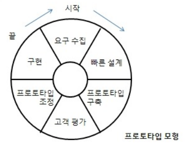
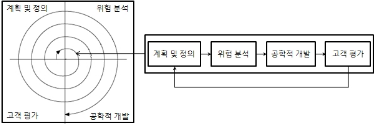
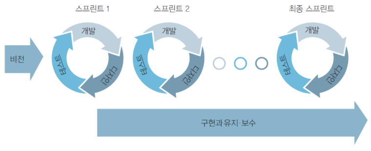

# [정보처리기사 001] - 소프트웨어 생명 주기 ★

# **# 소프트웨어 생명 주기(Software Life Cycle)**

소프트웨어 생명 주기는 소프트웨어 개발 방법론의 바탕이 되는 것이다.

소프트웨어를 개발하기 위해 정의, 운용, 유지보수 등의 과정을 각 단계별로 나눈 것이다.

여기서 **'소프트웨어 개발 방법론**'이란 소프트웨어 개발과 유지보수 등에 필요한 여러 가지 작업들의 수행 방법과 효율적인 기법 및 도구를 체계적으로 정리하여 표준화한 것이다.

일반적으로 소프트웨어는 요구사항을 분석해서 설계하고, 그에 맞게 개발한 후 품질이 항상 최상의 상태를 유지할 수 있도록 관리한다.

이러한 과정을 단계로 나누는 것을 소프트웨어 생명(수명) 주기라고 한다.

소프트웨어 생명 주기는 소프트웨어 개발 단계와 각 단계별 주요 활동, 활동 결과에 대한 산출물로 표현된다.

개발자는 문제의 유형이나 개발 방법에 따라 특정 모형을 선택하여 사용한다.

# **# 폭포수 모형(Waterfall Model)**

폭포수 모형은 이전 단계로 돌아갈 수 없다는 전제를 기본으로 둔다.

가장 오래되고 폭 넓게 사용된 전통적인 모형이다.

각 단계를 확실히 매듭짓고, 그 결과를 철저하게 검토하여 승인 후 다음 단계를 진행한다.

개발 과정의 한 단계가 끝나야만 다음 단계로 넘어갈 수 있는 **선형 순차적 모형**이다.

각 단계가 끝난 후에는 다음 단계를 수행하기 위한 결과물이 명확하게 산출되어야 한다.

두 개 이상의 과정이 병행하여 수행되지 않는다.

[타당성 검토] → [계획] → [요구 분석] → [설계] → [코딩] → [검사] → [유지보수]

# **# 프로토타입 모형(Prototype Model, 원형 모형)**

사용자의 요구사항을 정확히 파악하기 위해 실제 개발될 소프트웨어에 대한 견본품을 만들어 최종 결과물을 예측하는 모형이다.

소프트웨어 개발이 완료된 시점에서 오류가 발견되는 폭포수 모형의 단점을 보완하기 위한 모형이다.

프로토타입은 사용자와 시스템 사이의 인터페이스에 중점을 두고 개발한다.

시스템의 부분을 만들어가는 과정으로서 요구된 소프트웨어를 구현하는데, 이는 추후에 골격 코드로 사용된다.

  * 출처 링크 - https://yimma.tistory.com/95

    

# **# 나선형 모형(Spiral Model, 점진적 모형)**

폭포수 모형과 프로토타입 모형의 장점에 위험 분석 기능을 추가한 모형이다.

여러 번의 소프트웨어 개발 과정을 거쳐 점진적으로 최종 소프트웨어를 개발하는 것이다.

소프트웨어를 개발하면서 발생할 수 있는 위험을 관리 및 최소화하는 것을 목적으로 한다.

점진적으로 개발 과정이 반복되므로 누락되거나 추가된 요구사항을 첨가할 수 있고, 정밀하기 때문에 유지보수 과정이 필요 없다.

\

  * 출처 링크 - https://league-cat.tistory.com/153

# **# 애자일 모형(Agile Model)**

고객의 요구사항 변화에 유연하게 대응할 수 있도록 일정한 주기를 반복하면서 개발과정을 진행한다.

빠르고 낭비 없게 만들기 위해 고객과의 소통에 초점을 맞춘 방법론을 통칭한다.

애자일 모형은 스프린트(Sprint) 또는 이터레이션(Iteration)이라고 불리는 짧은 개발 주기를 반복하며, 주기마다 만들어지는 결과물에 대한 고객 평가와 요구를 적극 수용한다.

각 개발 주기에서는 고객이 요구사항에 우선순위를 부여하여 개발 작업을 진행한다.

소규모 프로젝트, 숙달된 개발자, 급변하는 요구사항에 적합하다.

\

  * 출처 링크 - https://post.naver.com/viewer/postView.nhn?volumeNo=16807486&memberNo=25828090

애자일 개발 4가지 핵심 가치

​    1) 프로세스와 도구보다는 개인과 상호작용에 더 가치를 둔다.

​    2) 방대한 문서보다는 실행되는 SW에 더 가치를 둔다.

​    3) 계약 협상보다는 고객과 협업에 더 가치를 둔다.

​    4) 계획을 따르기 보다는 변화에 반응하는 것에 더 가치를 둔다.

# **# 폭포수 모형 vs 애자일 모형**

| **구분**                 | **폭포수**                  | **애자일**                              |
| ------------------------ | --------------------------- | --------------------------------------- |
| **새로운 요구사항 반영** | 어려움                      | 지속적으로 반영                         |
| **고객과의 의사소통**    | 적음                        | 지속적                                  |
| **테스트**               | 마지막에 모든 기능을 테스트 | 반복되는 일정 주기가 끝날 때마다 테스트 |
| **개발 중심**            | 계획, 문서(매뉴얼)          | 고객                                    |