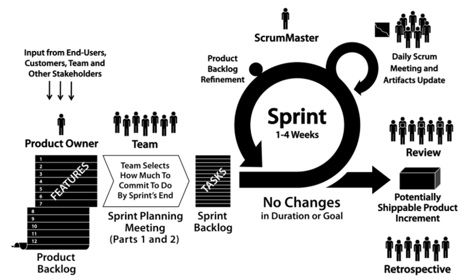

# [정보처리기사 002] - 스크럼(Scrum) 기법 ★

# **# 스크럼의 개요**

		* 출처 링크  : [https://hrbulletin.net/organizational-culture/%EC%95%A0%EC%9E%90%EC%9D%BC-%EB%B0%A9%EB%B2%95%EB%A1%A0%E2%91%A0-%EC%8A%A4%ED%81%AC%EB%9F%BCscrum/

스크럼은 **팀**이 **중심**이 되어 개발의 효율성을 높인다는 의미가 내포된 용어다.

팀원 스스로가 스크럼 팀을 구성하고, 개발 작업에 관한 모든 것을 스스로 해결해야 한다.

구성

**1) 제품 책임자(PO; Product Owner)**

​        \- 이해관계자 중 개발될 제품에 대한 이해도가 높고, 요구사항을 책임지고, 의사 결정의 주체(주로 개발 의뢰자나 사용자가 담당)로 한다.

​        cf) 여기서 '이해관계자'는 SW 개발 의뢰자, SW 개발자, SW 사용자 등

​        \- 이해관계자들의 의견을 종합하여 제품에 대한 요구사항이 담긴 백로그(Backlog, 개발에 필요한 요구사항을 모두 모아 우선순위를 부여한 목록)를 작성하는 주체이다.

​        \- 팀원들은 백로그를 추가할 수는 있지만 우선순위를 지정할 수는 없다.

​        cf) 여기서 '스토리'는 백로그에 담겨질 요구사항을 서술형으로 작성한 것이다.

​        \- 제품에 대한 테스트 결과를 참고하여 주기적으로 요구사항의 우선순위를 갱신한다.

**2) 스크럼 마스터(SM; Scrum Master)**

​        \- 팀의 수행을 돕기 위해 객관적인 시각에서 조언을 주는 가이드 역할이다.

​        \- 팀원을 통제하는 것이 아니라, 회의를 주관하여 진행 사항을 점검하고, 발생된 장애 요소를 공론화하여 처리한다.

**3) 개발팀(DT; Development Team)**

​        \- 제품책임자와 스크럼 마스터를 제외한 모든 팀원으로, 개발자, 디자이너, 테스터 등 제품 개발을 위해 참여한 모든 사람이다.

​        \- 보통 최대 인원은 7~8명이다.

# **# 스크럼 개발 프로세스**

**1) 제품 백로그(Product Backlog)**

​        \- 제품 개발에 필요한 모든 요구사항(User Story)을 우선순위에 따라 나열한 목록

​        \- 개발 과정에서 새롭게 도출되는 요구사항으로 인해 지속적으로 업데이트 된다.

​        \- 제품 백로그에 작성된 사용자 스토리를 기반으로 전체 일정 계획(Release Plan)을 수립한다.

**2) 스프린트 계획 회의(Sprint Planning Meeting)**

​        \- 제품 백로그 중 이번 스프린트에서 수행할 작업을 대상으로 단기 일정을 수립한다.

​        \- 당 스프린트에서 처리할 요구사항(User Story)을 개발자들이 나눠 작업할 수 있도록 Task 단위로 분할한다.

​        \- 개발자 별 수행할 작업 목록인 스프린트 백로그(Sprint Backlog)를 작성한다.

**3) 스프린트(Sprint)**

​        \- 실제 개발 작업을 진행하는 과정으로, 2~4주 정도의 기간 내에 진행한다.

​        \- 스프린트 백로그에 작성된 태스크를 대상으로 작업 시간(양)을 추정한 후 개발자에게 할당한다. 태스트를 할당할 때는 개발자가 원하는 태스크를 선별하도록 하는 것이 좋다.

​        \- 태스크는 할 일(To Do), 진행 중(In Progreess), 완료(Done)의 상태로 구분한다.

****

**4) 일일 스크럼 회의(Daily Scrum Meeting)**

​        \- 모든 팀원이 매일 약 15분 정도의 짧은 시간동안 진행 상황을 점검한다.

​        \- 스크럼 마스터는 발견된 장애 요소를 해결할 수 있도록 도와준다.

**5) 스프린트 검토 회의(Sprint Review)**

​        \- 부분 또는 전체 완성 제품이 요구사항에 잘 부합되는지 사용자가 포함된 참석자 앞에서 테스트한다.

​        \- 스프린트 한 주당 한 시간 내로 진행한다.

​        \- 제품 책임자는 개선 사항에 대한 피드백을 정리한 후 다음 스프린트에 반영할 수 있도록 제품 백로그를 업데이트 한다.

**6) 스프린트 회고(Sprint Retrospective)**

​        \- 스프린트 주기를 되돌아보며 정해놓은 규칙을 잘 준수했는지, 개선할 점을 확인한다.

​        \- 해당 스프린트가 끝난 시점에서 수행하거나 일정 주기로 수행한다.