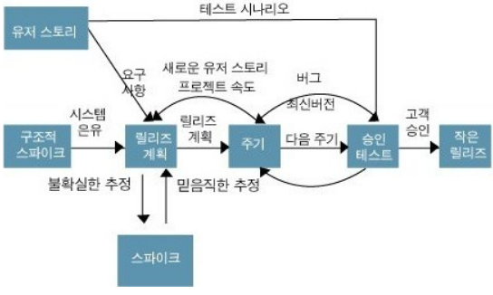

# [정보처리기사 003] - XP(eXtreme Programming) 기법 ★

# **# XP(eXtreme Programming)**

XP는 수시로 발생하는 고객의 요구사항에 유연하게 대응하기 위해 고객의 참여와 개발 과정의 반복을 극대화하여 개발 생산성을 향상시키는 방법이다.

몇 개의 요구사항이 적용된 일부 기능이 완성될 때마다 이를 고객에게 보여주고, 이에 대한 반응을 확인하는 과정을 최종 제품이 완성될 때까지 지속적으로 반복한다.

특징

1) XP는 **짧고 반복적인 개발 주기**, 단순한 설계, 고객의 적극적인 참여를 통해 소프트웨어를 빠르게 개발하는 것을 목적으로 한다.

2) **릴리즈***의 기간을 짧게 반복하면서 고객의 요구사항 반영에 대한 **가시성***을 높인다.

​        cf) 릴리즈 : 몇 개의 요구사항이 적용되어 부분적으로 기능이 완료된 제품을 제공하는 것

​        cf) 가시성 : 소프트웨어의 일부 기능이 구현될 때마다 요구사항이 반영되고 있음을 고객에게 확인시켜 주는 것

3) 릴리즈 테스트마다 고객을 직접 참여시킴으로써 요구한 기능이 제대로 작동하는지 고객이 직접 확인할 수 있다.

4) 비교적 소규모 인원의 개발 프로젝트에 효과적이다.

핵심 가치 5가지

\- 의사소통(Communication), 단순성(Simplicity), 용기(Courage), 존중(Respect), 피드백(Feedback)

# **# XP 개발 프로세스**

# 

**· 사용자 스토리(User Story)**

​        \- 고객의 요구사항을 간단한 시나리오로 표현한 것이다.

​        \- 내용은 기능 단위로 구성하며, 필요에 따라 간단한 테스트 사항도 기재한다.

**· 릴리즈 계획 수립(Release Planning)**

​        \- 릴리즈란 몇 개의 스토리가 적용되어 부분적으로 기능이 완료된 제품을 제공하는 것이다.

​        \- 부분 혹은 전체 개발 완료 시점에 대한 일정을 수립한다.

****

**· 스파이크(Spike)**

​        \- 요구사항의 신뢰성을 높이고 기술 문제에 대한 위험을 감소시키기 위해 별도로 만드는 간단한 프로그램이다.

​        \- 처리할 문제 외의 다른 조건은 모두 무시하고 작성한다.

**· 이터레이션(Iteration)**

​        \- 하나의 릴리즈를 더 세분화 한 단위를 이터레이션이라고 한다.

​        \- 일반적으로 1~3주 정도의 기간으로 진행된다.

​        \- 이 기간 중 새로운 스토리가 작성될 수 있으며, 작성된 스토리는 진행 중인 이터레이션 혹은 다음 이터레이션에 포함될 수 있다.

**· 승인 검사(Acceptance Test, 인수 테스트)******

​        \- 하나의 이터레이션 안에서 계획된 릴리즈 단위의 부분 완료 제품이 구현되면 수행하는 테스트이다.

​        \- 사용자 스토리 작성 시 함께 기재한 테스트 사항에 대해 고객이 직접 수행한다.

​        \- 테스트 과정에서 발견한 오류 사항은 다음 이터레이션에 포함한다.

​        \- 테스트 이후 새로운 요구사항이 작성되거나 요구사항의 상대적 우선순위가 변경될 수 있다.

​        \- 테스트가 완료되면 다음 이터레이션을 진행한다.

**· 소규모 릴리즈(Small Release)**

​        \- 릴리즈를 소규모로 진행하면, 고객의 반응을 기능별로 확인할 수 있어 고객의 요구사항에 유연하게 대응할 수 있다.

​        \- 계획된 릴리즈 기간 동안 진행된 이터레이션이 모두 완료되면 고객에 의한 최종 테스트를 수행한 후, 최종 결과물을 고객에게 전달(릴리즈)한다.

​        \- 릴리즈가 최동 완제품이 아닌 경우 다음 릴리즈 일정에 맞게 개발을 진행한다.

# **# XP 실천 방법(Practice)**

**· Pair Programming(짝 프로그래밍)**

​        \- 다른 사람과 함께 프로그래밍을 수행함으로써 개발에 대한 책임을 공동으로 갖는다.

****

**·  Test-driven Development(테스트 주도 개발)**

​        \- 개발자가 실제 코드를 작성하기 전에 테스트 케이스를 먼저 작성하므로 자신이 무엇을 해야할지 정확히 파악할 수 있다.

​        \- 테스트가 지속적으로 진행될 수 있도록 자동화된 테스팅 프레임워크를 사용한다.

****

**· Whole Team(전체 팀)**

​        \- 개발에 참여하는 모든 구성원(고객 포함)은 각자 역할이 있고 그 역할에 책임을 진다.

****

**· Continuous Integraion(계속적인 통합)**

​        \- 모듈 단위로 나눠 개발된 코드를 하나의 작업이 마무리 될 때 지속적으로 통합된다.

****

**· Design Improvemnet(디자인 개선, Refactoring)** 

​        \- 프로그램 기능의 변경 없이 단순화, 유연성 강화 등을 통해 시스템을 재구성한다.

****

**· Small Release(소규모 릴리즈)**

​        \- 릴리즈 기간을 짧게 반복함으로써 고객의 요구 변화에 신속히 대응한다.