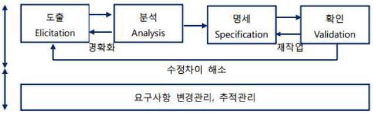

# [정보처리기사 006] - 요구사항 정의 ☆

# **# 요구사항의 개념 및 특징**

요구사항은 소프트웨어가 어떤 문제를 해결하기 위해 제공하는 서비스에 대한 설명과 정상적으로 운영되는데 필요한 제약조건 등을 나타낸다.

즉, 소프트웨어가 사용자의 요구사항을 충족시키기 위해 설계되고 개발되는 데에 필요한 조건이나 제약조건을 뜻한다.

요구사항은 소프트웨어 개발이나 유지 보수 과정에서 필요한 **기준**과 **근거**를 제공한다.

요구사항은 소프트웨어의 전반적인 내용을 확인할 수 있게 되므로 개발에 참여하는 이해관계자들 간의 의사소통을 원활하게 하는 데 도움을 준다.

요구사항이 제대로 정의되어야 이후 과정의 목표와 계획을 수립할 수 있다.

# **# 요구사항의 유형**

기술하는 내용에 따라 기능 요구사항과 비기능 요구사항으로 구분한다.

또한, 기술 관점과 대상의 범위에 따라 시스템 요구사항과 사용자 요구사항으로 나눈다.

**· 기능 요구사항(Functional Requirements)**

​        \- 시스템이 무엇을 하는지, 어떤 기능을 하는지에 대한 사항

​        \- 시스템의 입출력에 무엇이 포함되어야 하고, 시스템이 어떤 데이터를 저장하거나 연산하는지에 대한 사항

​        \- 시스템이 반드시 수행해야 하는 기능

​        \- 사용자가 시스템을 통해 제공받기를 원하는 기능

****

**· 비기능 요구사항(Non-Functional Requrements)**

​        \- 시스템 장비 구성 요구사항 : HW, SW, Network 등 시스템 장비 구성에 대한 사항

​        \- 성능 요구사항 : 처리 속도 및 시간, 처리량, 동/정적 적용량, 가용성 등에 대한 사항

​        \- 인터페이스 요구사항 : 시스템 인터페이스와 사용자 인터페이스에 대한 요구사항

​        \- 데이터 요구사항 : 초기 자료 구축 및 데이터 변환을 위한 대상, 방법, 보안이 필요한 데이터 등 데이터 구축을 위해 필요한 사항

​        \- 테스트 요구사항 : 도입되는 장비의 성능 테스트나 구축된 시스템의 운영 여부를 테스트하고 점검하기 위한 요구사항

​        \- 보안 요구사항 : 시스템의 데이터 및 기능, 운영 접근을 통제하기 위한 요구사항

​        \- 품질 요구사항 :관리가 필요한 품질 항목, 품질 평가 대상에 대한 요구사항

​        \- 제약사항 : 시스템 설계, 구축, 운영과 관련한 기술/표준/업무/법과 제도 등의 조건

​        \- 프로젝트 관리 요구사항 : 프로젝트의 원활한 수행을 위한 관리 방법에 대한 사항

​        \- 프로젝트 지원 요구사항 : 프로젝트의 원활한 수행을 위한 지원 및 방안에 대한 사항

**· 사용자 요구사항(User Requirement)**

​        \- 사용자 관점에서 시스템이 제공해야 할 요구사항

​        \- 사용자를 위한 것으로 친숙한 표현으로 이해하기 쉽게 작성

**· 시스템 요구사항(System Requrement)**

​        \- 개발자 관점에서 시스템 전체가 사용자나 다른 시스템에 제공해야 할 요구사항

​        \- 사용자 요구사항에 비해 전문적이고 기술적인 용어로 표현

​        \- 소프트웨어 요구사항이라고도 불림

# **# 요구사항 개발 프로세스**

요구사항 개발 프로세스는 개발 대상에 대한 요구사항을 체계적으로 도출하고 이를 분석한 후 결과를 명세서(Specification Documnet)에 정리한 다음 이를 확인 및 검증하는 일련의 구조화된 활동이다.

요구사항 개발 프로세스를 진행하기 전에 **타당성 조사**(Feasibility Study)*를 선행한다.

​        cf) 타당성 조사 : 개발 프로세스가 비즈니스 목적에 부합되는지, 예산은 적정한지 등에 대한 정보를 수집 및 평가한 보고서를 토대로 진행한다.

	* 출처 : [http://blog.skby.net/%EC%9A%94%EA%B5%AC%EA%B3%B5%ED%95%99-requirement-engineering/](http://blog.skby.net/요구공학-requirement-engineering/)

**1) 요구사항 도출(Requirement Elicitation, 요구사항 수집)**

​        \- 요구사항 도출은 시스템, 사용자, 이해관계자 모두 서로의 의견을 교환하며 요구사항을 수집, 식별, 이해하는 과정이다.

​        \- 소프트웨어가 해결해야 할 문제를 이해하는 첫 단계로, 개발자와 고객 사이의 관계가 만들어지고 이해관계자가 식별된다.

​        \- 요구사항 도출은 소프트웨어 개발 생명 주기(SDLC; Software Development Life Cycle) 동안 지속적으로 반복된다.

​        \- 요구사항을 도출하는 기법으로는 인터뷰, 설문, 브레인스토밍, 워크샵, 프로토타이핑, 유스케이스(사용자 요구사항을 기능 단위로 표현한 것) 등이 있다.

****

**2) 요구사항 분석(Requirement Analysis)**

​        \- 요구사항 분석은 개발 대상에 대한 사용자의 요구사항 중 명확하지 않거나 모호하여 이해되지 않은 부분을 발견하고 이를 걸러내기 위한 과정이다.

​        \- 사용자 요구사항의 타당성을 조사하고 비용과 일정에 대한 제약을 설정한다.

​        \- 중복되거나 하나로 통합되어야 하는 등 상충되는 요구사항을 해결한다.

​        \- 도출된 요구사항을 토대로 소프트웨어의 범위를 파악하고 소프트웨어 주변 환경이 상호 작용하는 방법을 이해한다.

****

**3) 요구사항 명세(Requirement Specification)**

​        \- 요구사항을 체계적으로 분석한 후 승인될 수 있도록 **문서화**하는 것이다.

​        \- 소프트웨어가 반드시 제공해야 하는 기능, 특징, 제약조건 등을 명시하고, 품질적 측면에서 성능, 보안, 사용성도 기술한다.

​        \- 기능 요구사항은 빠짐 없이 완전하고 명확하게 기술한다.

​        \- 비기능 요구사항은 필요한 것만 명확하게 기술한다.

​        \- 사용자가 이해하기 쉬우며, 개발자가 효과적으로 설계할 수 있도록 작성한다.

​        \- 설계 과정에서 잘못된 부분이 확인되면, 그 내용을 요구사항 정의서에서 찾을 수 있어야 한다.

****

**4) 요구사항 확인(Requirement Validation, 요구사항 검증)**

​        \- 요구사항 확인은 개발 자원을 요구사항에할당하기 전 요구사항 명세서가 정확하게 작성되었는지 검토하는 활동이다.

​        \- 요구사항을 정확하게 이해한 후 명세서를 작성한 것인지 **확인(Validation)**한다.

​        \- 명세서의 내용이 이해하기 쉬운지, 일관성은 있는지, 회사 기준에 맞는지, 누락된 기능은 없는지 등을 **검증(Verification)**한다.

​        \- 이해관계자들이 검토하고, 요구사항 정의 문서들에 대해 **형상 관리***를 수행한다.

​        cf) 형상 : 소프트웨어 개발 단계의 각 과정에서 만들어지는 프로그램과 그 프로그램을 설명하는 문서와 데이터 등을 통칭하는 단어

​        cf) 형상 관리 : 소프트웨어의 개발 과정에서 만들어지는 형상들의 변경 사항을 관리하는 활동

