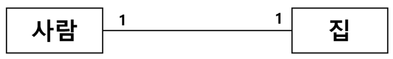
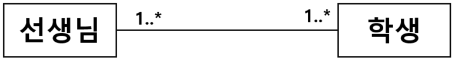
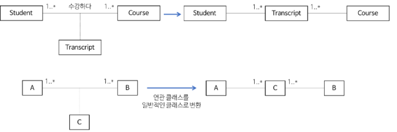
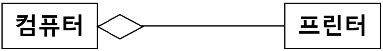
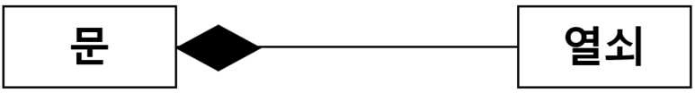
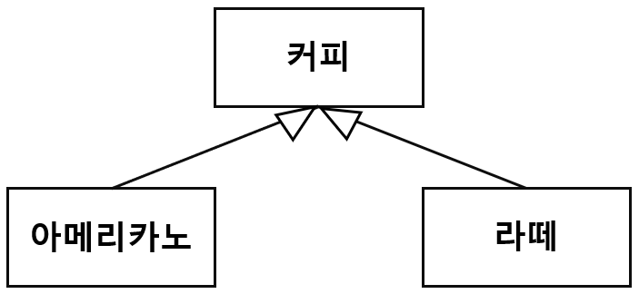
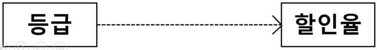
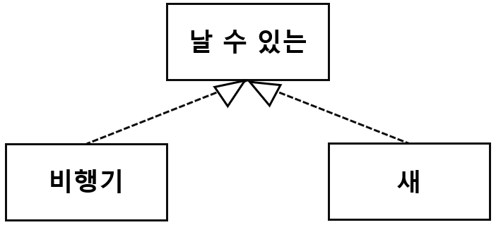
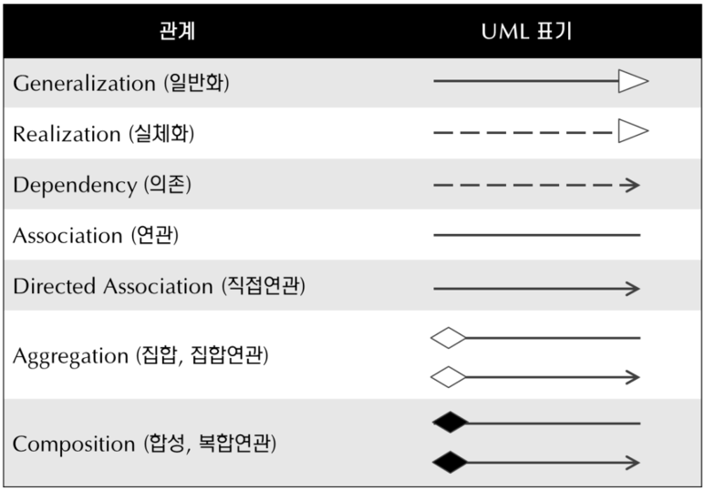

# [정보처리기사 009] - UML(Unified Modeling Language) ★

# **# UML의 개요**

많은 사람들이 모여 작업을 수행하면 같은 대상을 보고도 서로 다르게 표현하는 의사소통 상 문제가 생길 수 있다.

이런 문제를 해결하기 위해 공통된 표현 법을 만들고 사용하는 것이다.

UML은 공통된 표현법을 사용해 개발할 대상을 다이어그램으로 표현하는 도구이다.

소프트웨어 개발 참여자는 UML로 표현된 다이어그램으로 개발에 관한 의견을 교환한다.

UML은 시스템 분석, 설계, 구현 등 시스템 개발 과정에서 개발자와 고객 또는 개발자 상호 간의 의사소통이 원활하게 이루어지도록 표준화한 대표적인 객체지향 모델링 언어이다.

여기서 모델링 언어란 우리가 만들고자 하는 것을 시각적으로 표현할 수 있는 표기법, 도구 등을 의미한다.

UML은 객체지향 방법론(OMT, Booch, Jacobson 등)의 장점을 통합했으며, 객체 기술에 관한 국제표준화기구 OMG(Object Management Group)에서 표준으로 지정했다.

시스템 구조를 표현하는 6개의 구조 다이어그램과 시스템의 기능을 표현하는 7개의 행위 다이어그램을 작성하고, 각 다이어그램에는 사물과 사물의 관계를 용도에 맞게 표현한다.

# **# 사물(Things)**

사물은 모델을 구성하는 가장 중요한 기본 요소이다.

다이어그램 안에서 관계가 형성될 수 있는 대상을 말한다.

**· 구조 사물(Structural Things)**

​        \- 시스템의 개념적, 물리적 요소를 표현한 것

​        \- 클래스, 유스케이스, 컴포넌트, 노드 등

**· 행동 사물(Behavioral Things)**

​        \- 시간과 공간에 따른 요소들의 행위를 표현

​        \- 상호작용(Iteration), 상태 머신(State Machine) 등

**· 그룹 사물(Group Things)**

​        \- 요소들을 그룹으로 묶어서 표현

​        \- 패키지(Package)

**· 주해 사물(Annotation Things)**

​        \- 부가적인 설명이나 제약조건 등을 표현

​        \- 노트(Note)

# **# 관계(Relationships)**

사물과 사물 사이의 연관성을 표현하는 것으로, 6가지의 관계가 있다.

**· 연관(Association) 관계**

​        \- 연관 관계는 2개 이상의 사물이 서로 관련 있음을 표현한다.

​        \- 사물 사이를 실선으로 연결하고, 방향성은 화살표로 표현한다.

​        \- 서로에게 영향을 주는 양방향 관계의 경우 화살표를 생략하고, 실선으로만 연결한다.

​        \- 연관에 참여하는 객체의 개수를 의미하는 다중도(Multiplicity)를 선 위에 표기한다.

사람은 집 하나만 소유할 수 있고, 집은 한 사람에 의해 소유될 수 있다

학생은 한 명 이상의 선생님으로부터 가르침을 받고, 선생님은 한 명 이상의 학생을 가르친다.

출처 : https://gmlwjd9405.github.io/2018/07/04/class-diagram.html

**· 집합(Aggregation) 관계**

​        \- 집합 관계는 하나의 사물이 다른 사물에 포함되어 있는 관계를 표현한다.

​        \- 포함하는 쪽(전체, Whole)과 포함되는 쪽(부분, Part)은 서로 독립적이다.

​        \- 포함되는 쪽에서 포함하는 쪽으로 속이 빈 마름모를 연결하여 표현한다.

프린터는 컴퓨터에 연결되어 사용할 수 있고, 다른 컴퓨터에 연결해서 사용할 수도 있다.

**· 포함(Composition) 관계**

​        \- 집합 관계의 특수한 형태로, 포함하는 사물의 변화가 포함되는 사물에게 영향을 미치는 관계를 표현한다.

​        \- 포함하는 쪽과 포함되는 쪽은 서로 독립될 수 없고, 생명주기를 함께 한다.

​        \- 포함되는 쪽에서 포함하는 쪽으로 속이 채워진 마름모를 연결하여 표현한다.

문을 열 수 있는 키는 하나이며, 해당 키로 다른 문은 열 수 없다. 문이 없다면 키도 필요하지 않다.

**· 일반화(Generalization) 관계**

​        \- 하나의 사물이 다른 사물에 비해 더 일반적이거나 구체적인 관계를 표현한다.

​        \- 사람은 여자 또는 남자보다 일반적인 개념이고, 반대로 여자와 남자는 사람의 구체적인 개념이다.

​        \- 보다 일반적인 개념을 상위 또는 부모, 구체적인 개념을 하위 또는 자식이라 한다.

​        \- 구체적인 사물에서 일반적인 사물 쪽으로 속이 빈 화살표를 연결하여 표현한다.

아메리카노와 라떼는 커피이다. 즉, 커피의 종류에는 아메리카노와 라떼가 있다.

**· 의존(Dependency) 관계**

​        \- 연관 관계와 같이 사물 사이에 서로 연관은 있으나 필요에 의해 서로에게 영향을 주는 짧은 시간 동안만 연관을 유지하는 관계를 표현한다.

​        \- 하나의 사물과 다른 사물이 소유 관계는 아니지만 사물의 변화가 다른 사물에도 영향을 미치는 관계이다.

​        \- 영향을 주는 사물이 영향을 받는 사물 쪽으로 점선 화살표를 연결하여 표현한다.

등급이 높으면 할인율을 적용하고, 낮으면 적용하지 않는 상황을 표현한다.

**· 실체화(Realization) 관계**

​        \- 사물이 할 수 있거나 해야 하는 기능(행위, 인터페이스)으로 서로를 그룹화 할 수 있는 관계를 표현한다.

​        \- 사물에서 기능 쪽으로 속이 빈 점선 화살표를 연결하여 표현한다.

비행기는 날 수 있고, 새도 날 수 있다. 비행기와 새를 날 수 있다는 행위로 그룹화 한다.

출처 : http://www.nextree.co.kr/p6753/

# **# 다이어그램(Diagram)**

사물과 관계를 도형으로 표현한 것을 다이어그램이라고 한다.

여러 관점에서 시스템을 가시화 한 View를 제공함으로써 의사소통에 도움을 준다.

정적 모델링에서는 구조적 다이어그램을, 동적 모델링에서는 행위 다이어그램을 사용한다.

**[구조(Structural) 다이어그램의 종류]**

**· 클래스(Class) 다이어그램**

​        \- 클래스와 클래스가 가지는 속성, 클래스 사이의 관계를 표현한다.

​        \- 시스템 구조를 파악하고 구조상 문제점을 도출할 수 있다.

**· 객체(Object) 다이어그램**

​        \- 클래스에 속한 사물(객체), 즉 인스턴스(Instance)를 특정 시점의 객체와 객체 사이의 관계로 표현한다.

**· 컴포넌트(Component) 다이어그램**

​        \- 실제 구현 모듈인 컴포넌트 간의 관계나 컴포넌트 간의 인터페이스를 구현한다.

​        \- 구현 단계에서 사용되는 다이어그램이다.

**· 배치(Beployment) 다이어그램**

​        \- 결과물, 프로세스, 컴포넌트 등 물리적 요소들의 위치를 표현한다.

​        \- 노드와 통신(의사소통) 경로로 표현한다.

​        \- 구현 단계에서 사용되는 다이어그램이다.

**· 복합체 구조(Composite Structure) 다이어그램**

​        \- 클래스나 컴포넌트가 복합 구조를 갖는 경우 그 내부 구조를 표현한다.

**· 패키지(Package) 다이어그램**

​        \- 유스케이스나 클래스 등의 모델 요소들을 그룹화한 패키지들의 관계를 표현한다.

****

**[행위(Behavioral) 다이어그램의 종류]**

**· 유스케이스(Use-Case) 다이어그램**

​        \- 사용자의 요구를 분석하는 것으로, 기능 모델링 작업에 사용한다.

​        \- 사용자와 사용 사례로 구성되며, 사용 사례 간 여러 형태의 관계를 표현한다.

**· 시퀀스(Sequence) 다이어그램**

​        \- 상호 작용하는 시스템이나 객체들이 주고받는 메시지를 표현한다.

**· 커뮤니케이션(Communication) 다이어그램**

​        \- 시퀀스 다이어그램과 같이 동작에 참여하는 객체들이 주고받는 메시지를 표현한다.

​        \- 메시지뿐만 아니라 객체들 간의 연관까지 표현한다.

**· 상태(State) 다이어그램**

​        \- 하나의 객체가 자신이 속한 클래스 상태 변화 또는 다른 객체와의 상호 작용에 따라 어떻게 상태가 변하는지를 표현한다.

**· 활동(Activity) 다이어그램**

​        \- 시스템이 어떤 기능을 수행하는지 객체의 처리 로직이나 조건에 따른 처리의 흐름을 순서에 따라 표현한다.

**· 상호작용 개요(Interaction Overview) 다이어그램**

​        \- 상호작용 다이어그램 간의 제어 흐름을 표현한다.

**· 타이밍(Timing) 다이어그램**

​        \- 객체 상태 변화와 시간 제약을 명시적으로 표현한다.