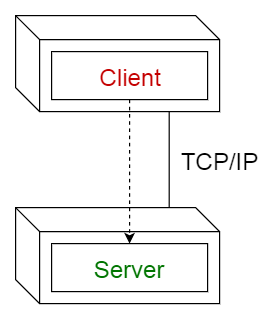
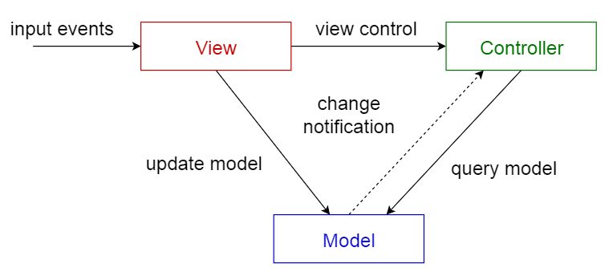

# [정보처리기사 021] - 아키텍쳐 패턴 ★

# **# 아키텍처 패턴 개요**

아키텍처를 설계할 때 참조할 수 있는 전형적인 해결 방식 또는 예제를 의미한다.

아키텍처 패턴은 소프트웨어 시스템의 구조를 구성하기 위한 기본적인 윤곽을 제시한다.

아키텍처 패턴에는 서브시스템들과 그 역할이 정의되어 있으며, 서브시스템 사이의 관계와 여러 규칙/지침 등이 포함되어 있다.

아키텍처 패턴으로 인한 여러가지 장점들이 있다.

· 검증된 구조로 개발하기 때문에 시행착오를 줄이고 안정적인 개발이 가능하다.

· 개발 시간을 단축시키고, 고품질의 소프트웨어를 생산할 수 있다.

· 이해관계자들이 공통된 아키텍처를 공유하기 때문에 의사소통이 간편해진다.

· 시스템 구조 파악이 쉬워지기 때문에 새로운 개발자가 유지보수하기에 용이하다.

· 시스템 특성을 개발 전에 예측하는 것이 가능하다.

# **# 레이어(Layers) 패턴**

시스템을 계층으로 구분하여 구성하는 방법 중 하나이다.

각각의 서브시스템들이 계층 구조를 이루며, 상위 계층은 하위 계층에 대한 서비스 제공자가 되고, 하위 계층은 상위 계층의 클라이언트가 된다.

레이어 패턴은 서로 이웃하는 두 계층 사이에서만 상호작용이 이루어지며, 변경 사항을 적용할 때에도 서로 마주보는 두 계층에만 영향을 준다.

레이어 패턴은 특정 계층만을 교체해 시스템을 개선하는 것이 가능하다.

출처 : https://mingrammer.com/translation-10-common-software-architectural-patterns-in-a-nutshell/

# **# 클라이언트-서버(Client-Server) 패턴**

하나의 서버 컴포넌트와 다수의 클라이언트 컴포넌트로 구성되는 패턴이다.

사용자는 클라이언트를 통해 서버와 의사소통한다.

즉, 사용자가 클라이언트를 통해 서버에 요청하고, 클라이언트가 응답을 받아 사용자에게 제공하는 방식으로 서비스를 제공한다.

클라이언트나 서버는 요청과 응답을 받기 위해 동기화되는 경우를 제외하고는 독립적이다.

서버는 클라이언트의 요청에 대비해 항상 대기 상태를 유지한다.

출처 : https://mingrammer.com/translation-10-common-software-architectural-patterns-in-a-nutshell/

# **# 파이프-필터(Pipe=Filter) 패턴**

데이터 스트림* 절차의 각 단계를 필터 컴포넌트로 캡슐화하여 파이프를 통해 데이터를 전송하는 패턴이다.

여기서 데이터 스트림은 데이터가 송수신되거나 처리되는 일련의 연속적인 흐름이다.

필터 컴포넌트는 재사용성이 좋고, 추가가 쉬워 확정이 용이하다.

필터 컴포넌트를 재배치하여 다양한 파이프 라인*을 구축하는 것이 가능하다.

여기서 파이프 라인은 필터와 파이프를 통해 처리되는 일련의 처리 과정을 뜻한다.

파이프-필터 패턴은 데이터 변환, 버퍼링, 동기화 등에 주로 사용된다.

출처 : https://mingrammer.com/translation-10-common-software-architectural-patterns-in-a-nutshell/

# **# 모델-뷰-컨트롤러(MVC) 패턴**

서브 시스템을 3개의 부분으로 구조화하는 패턴이다.

· 모델(Model) : 서브 시스템의 핵심 기능과 데이터를 보관한다.

· 뷰(View) : 사용자에게 정보를 표시한다.

· 컨트롤러(Controller) : 사용자로부터 받은 입력을 처리한다.

각 부분은 별도의 컴포넌트로 분리되어 있으므로 서로 영향을 받지 않고 개발 작업을 수행할 수 있다.

여러 뷰를 만들 수 있으므로 한 개의 모델에 대해 여러 개의 뷰를 필요로하는 대화형 애플리케이션에 적합하다.

출처 : https://mingrammer.com/translation-10-common-software-architectural-patterns-in-a-nutshell/

