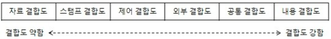

# [정보처리기사 023] - 모듈 ★

# **# 모듈(Module)의 개요**

**모듈화**를 통해 분리된 시스템의 각 기능들을 모듈이라고 한다.

**모듈**은 단독으로 컴파일 가능하기 때문에 재사용이 가능하다.

모듈화는 소프트웨어의 성능을 향상시키거나 시스템의 수정 및 재사용, 유지관리 등이 용이하도록 시스템의 기능들을 모듈 단위로 분해하는 것을 의미한다.

# **# 모듈의 독립성**

모듈의 기능적 독립성은 모듈이 하나의 기능만 수행하고 다른 모듈과의 상호작용을 배제함으로써 이뤄진다.

즉, 소프트웨어를 구성하는 각 모듈의 기능이 서로 독립됨을 의미한다.

독립성이 높은 모듈일수록 모듈을 수정하더라도 다른 모듈들에게 영향을 적게 주고, 오류가 발생해도 쉽게 발견하고 해결할 수 있다.

모듈의 **독립성**은 결합도와 응집도에 의해 측정된다.

독립성을 높이려면 모듈의 결합도는 약하게, 응집도는 강하게, 모듈의 크기는 작게 만든다.

**1) 결합도(Coupling)**

​       · 모듈 간에 상호 의전 정도 또는 모듈 사이의 **연관 관계**를 의미한다.

​       · 다양한 결합으로 모듈을 구성할 수 있으나, 결합도와 품질은 반비례 관계에 있다.

​       · 결합도가 강하면 품질이 낮고, 시스템 구현 및 유지보수 작업이 어렵다.

	* 출처 : https://m.blog.naver.com/rlarhdn66/220463191697

| **자료(Data) 결합도**        | 모듈 간 인터페이스가 자료 요소로만 구성될 때의 결합도이다. 어떤 모듈이 다른 모듈을 호출하면서 매개변수나 인수로 데이터를 넘기고, 호출 받은 모듈은 받은 데이터에 대한 처리 결과를 반환한다. 한 모듈이 내용 변경을 하더라도 다른 모듈에는 전혀 영향을 미치지 않는 바람직한 결합도이다. |
| ---------------------------- | ------------------------------------------------------------ |
| **검인(Stamp) 결합도**       | 모듈 간 인터페이스로 배열이나 레코드 등의 자료 구조가 전달될 때의 결합도이다. 두 모듈이 동일한 자료 구조를 조회하는 경우의 결합도이다. 자료 구조의 포맷이나 구조의 변화는 이 구조를 조회하는 모든 모듈이나 조회하지 않는 모듈에게도 영향을 준다. |
| **제어(Control) 결합도**     | 다른 모듈 내부의 논리적 흐름을 제어하기 위해 제어 신호를 이용하여 통신하거나 제어 요소를 전달하는 결합도이다. |
| **외부(External) 결합도**    | 어떤 모듈에서 선언한 데이터(변수)를 외부 다른 모듈에서 참조할 때의 결합도이다. 참조되는 데이터의 범위를 각 모듈에서 제한할 수 있다. |
| **공통/공유(Common) 결합도** | 공유되는 공통 데이터 영역을 여러 모듈이 사용할 때의 결합도이다. 공통 데이터 영역을 변경하면 이를 사용하는 모든 모듈에 영향을 주므로 모듈의 독립성을 약하게 만든다. |
| **내용(Content) 결합도**     | 한 모듈이 다른 모듈의 내부 기능 및 그 내부 자료를 직접 참조하거나 수정할 때의 결합도이다. 한 모듈에서 다른 모듈의 내부로 제어가 이동하는 경우에도 해당된다. |

**2) 응집도(Cohesion)**

​       · 정보 은닉 개념을 확장한 것으로, 명령어나 호출문 등 모듈의 내부 요소들의 서로 관련되어 있는 정도이다.

​       · 즉, 모듈이 독립적인 기능으로 정의되어 있는 정도를 의미한다.

​       · 다양한 기준으로 모듈을 구성할 수 있으나, 응집도와 품질을 비례관계에 있다.

	* 출처 : https://m.blog.naver.com/rlarhdn66/220463191697

| **기능적(Functional) 응집도**    | 모듈 내부의 모든 기능 요소들이 단일 문제와 연관되어 수행될 경우 |
| -------------------------------- | ------------------------------------------------------------ |
| **순차적(Sequential) 응집도**    | 모듈 내 하나의 활동으로부터 나온 출력 데이터를 그 다음 활동의 입력 데이터로 사용할 경우 |
| **통신적(Communication) 응집도** | 동일한 입출력을 사용하여 서로 다른 기능을 수행하는 구성 요소들이 모였을 경우 |
| **절차적(Procedural) 응집도**    | 모듈이 다수의 관련 기능을 가질 때 모듈 안의 구성 요소들이 그 기능을 순차적으로 수행할 경우 |
| **시간적(Temporal) 응집도**      | 특정 시간에 처리되는 몇 개의 기능을 모아 하나의 모듈로 작성할 경우 |
| **논리적(Logical) 응집도**       | 유사한 성격을 갖거나 특정 형태로 분류되는 처리 요소들로 하나의 모듈이 형성되는 경우 |
| **우연적(Coincidental) 응집도**  | 모듈 내부의 각 구성 요소들이 서로 관련 없는 요소로만 구성된 경우 |

# **# 팬인(Fan-In) / 팬아웃(Fan-Out)**

**팬인**은 어떤 모듈을 제어/호출하는 모듈의 수, 즉 자신을 사용하는 모듈 수를 나타낸다.

**팬아웃**은 어떤 모듈에 의해 제어/호출되는 모듈의 수, 즉 자신이 사용하는 모듈 수를 나타낸다.

 * 참고 링크 : https://post.naver.com/viewer/postView.nhn?volumeNo=27424202&memberNo=26040503

   

팬인, 팬아웃을 분석하여 시스템의 복잡도를 알 수 있다.

시스템 복잡도를 최소화하려면 팬인은 높게, 팬아웃은 낮게 설계해야 한다.

팬인이 높다는 것은 재사용 측면에서 잘 설계된 것으로 볼 수 있으나, **단일 장애점***이 발생할 수 있으므로 중점적인 관리 및 테스트가 필요하다.

​        cf) 단일 장애점(SPOF, Single Point Of Failure) : 시스템 구성 요소 중 동작하지 않으면 전체 시스템이 멈추게 되는 요소를 의미한다.

팬아웃이 높은 경우에는 불필요하게 다른 모듈을 호출하고 있는지 검토하고, 단순화 시키 수 있는지에 대한 검토가 필요하다.