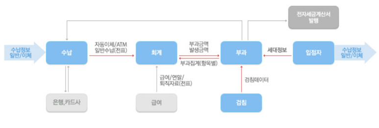

[정보처리기사 030] - 송수신 데이터 식별

# 

# **# 식별 대상 데이터**

개발할 시스템의 내외부 인터페이스를 위해 필요한 송수신 데이터를 정확히 식별해야 한다.

이는 시스템 내부 및 다른 시스템과의 인터페이스에 의해 전달되는 정보 변조 및 손실을 예방하기 위함이다.

송수신 데이터 식별은 개발 시스템과 연계할 내외부 시스템 사이의 정보 흐름과 데이터베이스 산출물들을 기반으로 한다.

식별 대상 데이터는 송수신 시스템 사이에서 교환되는 데이터를 뜻한다.

규격화된 표준 형식에 따라 전송되고, 아래 3가지의 종류가 있다.

**1) 인터페이스 표준 항목**

​        \- 송수신 시스템을 연계하는데 표준적으로 필요한 데이터를 의미한다.

​        \- 시스템 공통부 : 시스템 간 연동 시 필요한 공통 정보

​        \- 거래 공통부 : 시스템 연동 후 송수신 되는 데이터를 처리할 때 필요한 정보

**2) 송수신 데이터 항목**

​        \- 송수신 시스템이 업무를 수행하는 데 사용하는 데이터를 뜻한다.

​        \- 전송되는 데이터 항목과 순서는 인터페이스 별로 상이하다.

**3) 공통 코드**

​        \- 시스템들이 공통적으로 사용하는 코드를 뜻한다.

​        \- 연계 시스템 또는 연계 소프트웨어에서 사용하는 상태/오류 코드 등을 관리한다.

# **# 정보 흐름 식별**

개발할 시스템과 내외부 시스템 사이에서 전송되는 정보들의 방향성을 식별하는 것이다.

여기서 '**방향성******'은 송수신 시스템간 데이터를 전송하고 받는 형태로, 단/양방향이 있다. 

개발할 시스템과 내외부 시스템에 대한 각각의 인터페이스 목록을 확인하여 정보 흐름을 식별한다.

식별 정보 흐름을 기반으로 송수신 시스템 사이에서 교환되는 주요 데이터 항목이나 정보 그룹을 도출한다.

여기서 **정보 흐름**이란 필요 시 다이어그램 형태로 작성한다.

* 출처 : https://product.aegisep.com/ags/xperp.jsp

# **# 송수신 데이터 식별**

개발할 시스템과 연계할 내외부 시스템 사이의 정보 흐름과 데이터베이스 산출물을 기반으로 송수신 데이터를 식별한다.

**1) 인터페이스 표준 항목**

​        \- 송수신 시스템 사이의 교환 범위를 확인하고 인터페이스 표준 항목에 대해 송수신 데이터 항목을 식별한다.

**2) 코드성 데이터 항목 식별**

​        \- 코드성 데이터 항목에 대해 코드, 코드명, 코드 설명 등 코드 정보를 식별한다.