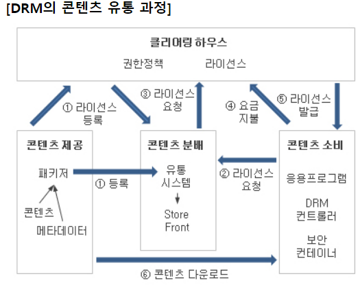

# [정보처리기사 043] - 디지털 저작권 관리(DRM) ★

# **# 저작권의 개요**

**저작권**이란 저작물에 대하여 창작자가 가지는 배타적 독점적 권리로, 타인의 침해를 받지 않을 고유한 권한이다.

컴퓨터 프로그램처럼 복제가 쉬운 저작물에 대해 불법 복제 및 배포를 막기 위한 기술적 방법을 통칭해 **저작권 보호 기술**이라고 한다.

# **# 디지털 저작권 관리(DRM; Digital Right Management)의 개요**

저작권자가 배포한 디지털 콘텐츠가 저작권자가 의도한 용도로만 사용되도록 콘텐츠의 생성, 유통, 이용까지의 전 과정에 걸쳐 사용되는 디지털 콘텐츠 관리 및 보호기술이다.

원본 콘텐츠가 아날로그인 경우, 디지털로 변환해 패키저(packager)에 의해 DRM 패키징을 수행한다.

콘텐츠의 크기에 따라 크기가 작은 경우(음원, 문서 등) 사용자가 콘텐츠를 요청하는 시점에서 실시간으로 패키징을 수행하고, 크기가 큰 경우에는 미리 패키징 수행 후 배포한다.

패키징을 수행하면서 콘텐츠에는 암호화된 저작권자의 전자서명이 포함되고, 저작권자가 설정한 라이선스 정보가 **클리어링 하우스*******에 등록된다.

​        cf) 클리어링 하우스(Clearing House) : 디지털 저작권 라이선스의 중개 및 발급을 수행하는 곳, 디지털 저작물의 이용 내역을 근거로 저작권료의 정산 및 분배가 수행된다.

사용자가 콘텐츠를 사용하기 위해서 클리어링 하우스에 등록된 라이선스 정보를 통해 사용자 인증과 콘텐츠 사용 권한 소유 여부를 확인받아야 한다.

**종량제 방식*******을 적용한 소프트웨어의 경우 클리어링 하우스를 통해 서비스의 실제 사용량을 측정하여 이용량 만큼의 요금을 부과한다.

​        cf) 종량제 방식 : 실제 사용한 양에 따라 요금을 차등 적용하는 방식

# **# 디지털 저작권 관리의 흐름도**

* 출처 : https://m.blog.naver.com/xcripts/70121125086

| **클리어링 하우스****(Clearing House)**     | 저작권에 대한 사용 권한, 라이선스 발급, 사용량에 따른 결제 관리 등을 수행하는 곳 |
| ------------------------------------------- | ------------------------------------------------------------ |
| **콘텐츠 제공자****(Contents Provider)**    | 콘텐츠를 제공하는 저작권자                                   |
| **패키저****(Packager)**                    | 콘텐츠를 메타 데이터*****와 함께 배포 가능한 형태로 묶어 암호화하는 프로그램cf) 메타 데이터 : 데이터에 대한 속성 정보 등을 설명하기 위한 데이터 |
| **콘텐츠 분배자****(Contents Distributor)** | 암호화된 콘텐츠를 유통하는 곳이나 사람                       |
| **콘텐츠 소비자****(Customer)**             | 콘텐츠를 구매해서 사용하는 주체                              |
| **DRM 컨트롤러****(Controller)**            | 배포된 콘텐츠의 이용 권한을 통제하는 프로그램                |
| **보안 컨테이너****(Security Container)**   | 콘텐츠 원본을 안전하게 유통하기 위한 전자적 보안 장치        |

# **# 디지털 저작권 관리의 기술 요소**

**· 암호화(Encryption)** : 콘텐츠 및 라이선스를 암호화하고 전자 서명할 수 있는 기술

**· 키 관리(Key Management)** : 콘텐츠를 암호화한 키에 대한 저장 및 분배 기술

**· 암호화 파일 생성(Packager)** : 콘텐츠를 암호화된 콘텐츠로 생성하기 위한 기술

**· 식별 기술(Identification)** : 콘텐츠에 대한 식별 체계 표현 기술

**· 저작권 표현(Right Expression)** : 라이선스의 내용 표현 기술

**· 정책 관리(Policy Managemnet)** : 라이선스 발급 및 사용에 대한 정책 표현 및 관리 기술

**· 크랙 방지(Tamper Resistance)** : 크랙*에 의한 콘텐츠 사용 방지 기술

​        cf) 크랙 : 불법적인 방법으로 소프트웨어에 적용된 저작권 보호 기술을 해제 및 무단 사용할 수 있도록 하는 기술이나 도구

**· 인증(Authentication)** : 라이선스 발급 및 사용의 기준이 되는 사용자 인증 기술