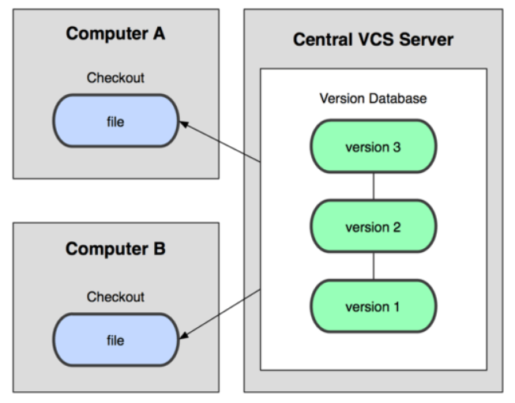
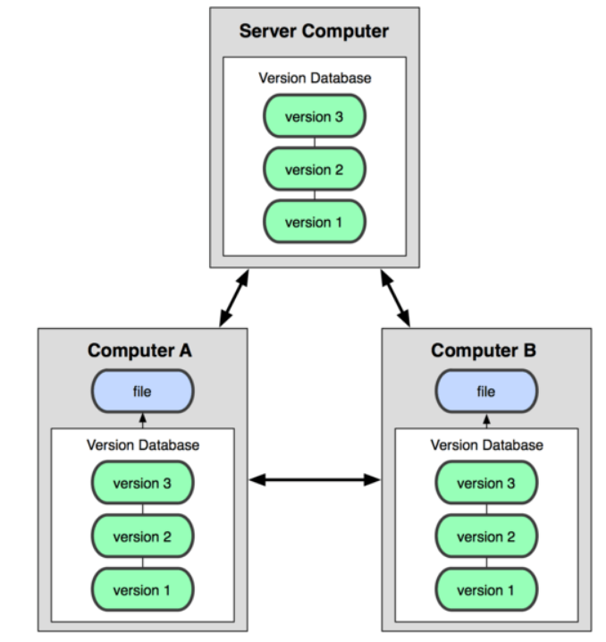

# [정보처리기사 047] - 소프트웨어 버전 관리 도구 ★

# **# 공유 폴더 방식**

버전 관리 자료가 로컬 컴퓨터의 공유 폴더에 저장되어 관리되는 방식이다.

· 개발자들은 개발이 완료된 파일을 약속된 공유 폴더에 매일 복사한다.

· 담당자는 공유 폴더의 파일을 자신의 PC로 복사 후 컴파일 하여 이상 유무를 확인한다.

· 파일 오류가 확인되면, 해당 파일을 등록한 개발자에게 수정을 의뢰하고, 파일에 이상이 없다면, 각 개발자들이 동작 여부를 다시 확인한다.

· 파일을 잘못 복사하거나 다른 위치로 복사하는 등의 문제를 대비하여 파일의 변경 사항을 데이터베이스에 기록하여 관리한다.

종류 : SCCS, RCS, PVCS, QVCS 등

# **# 클라이언트-서버 방식**

버전 관리 자료가 중앙 시스템(서버)에 저장되어 관리되는 방식이다.

· 모든 버전 관리는 서버에서 수행된다.

· 서버의 자료를 개발자별로 자신의 PC(클라이언트)로 복사하여 작업 후 변경 내용을 서버에 반영한다.

· 하나의 파일을 서로 다른 개발자가 작업할 경우 경고 메시지를 출력한다.

· 서버에 문제가 생기면, 서버가 복귀될 때까지 다른 개발자와의 협업 및 버전 관리가 중단된다.

종류 : CVS, SVN, CVSNT, Clear Case, CMVC, Perforce 등

# **# 분산 저장소 방식**

버전 관리 자료가 하나의 원격 저장소와 분산된 개발자 PC의 로컬 저장소에 함께 저장되어 관리되는 방식이다.

· 개발자별로 원격 저장소의 자료를 자신의 로컬 저장소로 복사하여 작업한 후 변경 된 내용을 로컬 저장소에서 우선 반영(버전 관리)한 다음, 이를 원격 저장소에 반영한다.

· 로컬 저장소에서 버전 관리가 가능하므로 원격 저장소에 문제가 생기더라도 로컬 저장소의 자료를 이용하여 작업할 수 있다.

종류 : Git, GNU arch, DCVS, Bazaar, Mercurial, TeamWare, Bitkeeper, Plastic SCM 등 

# **# Subversion(SVN)**

Subversion은 CVS를 개선(파일/디렉터리의 이름 변경, 이동 등)한 것으로, 아파치 SW 재단에서 발표했고, 무료로 사용할 수 있다.

· 클라이언트-서버 구조

· 서버(저장소, Repository)에는 최신 버전의 파일들과 변경 내역이 관리된다.

· 서버의 자료를 클라이언트로 복사해서 작업 후 변경 내용을 서버에 반영(Commit)한다.

· 클라이언트는 대부분의 운영체제에서 사용되지만, 서버는 주로 유닉스를 사용한다.

· 모든 개발 작업은 trunk 디렉터리에서 수행되고, 추가 작업은 branches 디렉터리 안에 별도의 디렉터리를 만들어 잡업 후 trunk 디렉터리와 병합(merge)한다.

· Commit 할 때마다 Revision이 1씩 증가한다.

출처 : https://velog.io/@shson/subversion과-git의-차이점-zak64wn6ic

# **# Git**

Git은 리누스 토발즈가 리눅스 커널 개발에 사용할 관리 도구로 개발한 이후, Junio Hamano에 의해 유지 보수되고 있다.

· 분산 버전 관리 시스템

· 2개의 저장소(로컬 저장소와 원격 저장소)가 존재한다.

· 지역 저장소는 개발자들이 실제 개발을 진행하는 장소로, 버전 관리가 수행된다.

· 원격 저장소는 협업을 위한 공간으로 버전 관리를 공동으로 진행한다. 자신의 버전 관리 내역을 반영하거나, 다른 개발자의 변경 내용을 가져올 때 사용한다.

· 버전 관리가 지역 저장소에서 진행되므로 버전 관리가 신속하게 처리되고, 원격 저장소나 네트워크 문제가 있어도 작업이 가능하다.

· Branches를 사용하면 기본 버전 관리 틀에 영향을 주지 않으면서 다양한 형태의 기능 테스팅이 가능하다.

· 파일의 변화를 Snapshot으로 저장하는데, 스냅샷은 이전 스냅샷의 포인터를 가지고 버전의 흐름을 파악할 수 있게 해준다.

출처 : https://velog.io/@shson/subversion과-git의-차이점-zak64wn6ic

