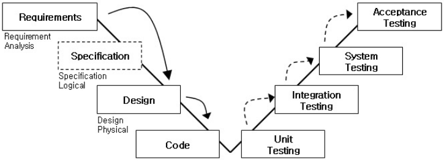

# [정보처리기사 052] - 개발 단계에 따른 애플리케이션 테스트 ★

**# 개발 단계에 따른 애플리케이션 테스트**

애플리케이션 테스트는 SW의 개발 단계에 따라 분류되고, 이를 테스트 레벨이라고 한다.

SW의 개발 단계에서부터 테스트를 수행하므로 단순히 SW에 포함된 코드 상의 오류뿐만 아니라, 요구 분석의 오류나 설계 인터페이스 오류 등도 발견할 수 있다.

애플리케이션 테스트와 소프트웨어 개발 단계를 연결해 도식화 한 것을 **V-모델**이라 한다.

**SW 생명 주기의 V-모델**은 **소프트웨어 개발 단계**(요구사항~분석~설계~구현)와 **테스트 단계**(단위~통합~시스템~인수)로 구성된다.

출처 : http://blog.daum.net/charmingjerry/14

**1) 단위 테스트(Unit Test)**

​    \- 코딩 직후 SW 설계의 최소 단위인 모듈이나 컴포넌트에 초점을 맞춘 테스트

​    \- 인터페이스, 외부적 I/O, 자료 구조, 독립적 기초 경로, 오류 처리 경로, 경계 조건 검사

​    \- 사용자 요구사항을 기반으로 한 기능성 테스트를 최우선으로 수행

​    \- 구조 기반 테스트 : 프로그램 내부 구조 및 복잡도 검토(화이트박스 테스트), 제어 흐름과 조건 결정이 테스트의 목적

​    \- 명세 기반 테스트 : 목적 및 실행 코드 기반 테스트(블랙박스 테스트), 동등 분할과 경계 값 분석이 테스트의 목적

**2) 통합 테스트(Integration Test)**

​    \- 단위 테스트가 완료된 모듈들을 결합해 하나의 시스템으로 완성시키는 과정의 테스트

​    \- 모듈 간 또는 통합 컴포넌트 간의 상호 작용 오류를 검사

**3) 시스템 테스트(System Test)**

​    \- 개발된 소프트웨어가 해당 컴퓨터 시스템에서 완벽히 수행되는가를 점검하는 테스트

​    \- 실제 환경과 유사하게 테스트 환경을 구축해야 환경적 장애 리스크를 최소화할 수 있다

​    \- 비기능적 요구사항 : 성능 테스트, 회복 테스트, 보안 테스트, 내부 시스템의 메뉴 구조, 웹 페이지의 네비게이션 등 구조적 요소에 대한 화이트박스 테스트 시행

​    \- 기능적 요구사항 : 요구사항 명세서, 비즈니스 절차, 유스케이스 등 명세서 기반의 블랙박스 테스트 시행

**4) 인수 테스트(Acceptance Test)**

​    \- 개발한 SW가 사용자의 요구사항을 충족하는지에 중점을 두고 테스트

​    \- 사용자가 직접 테스트하고, 문제가 없다면 SW를 인수하고 프로젝트는 종료

​    \- **사용자 인수 테스트** : 사용자가 시스템 사용의 적절성 여부를 확인

​    \- **운영상의 인수 테스트** : 시스템 관리자가 시스템 인수 시 수행하는 테스트 기법, 백업/복원 시스템, 재난 복구, 사용자 관리, 정기 점검 등을 확인

​    \- **계약 인수 테스트** : 계약상의 인수/검수 조건을 준수하는지 여부를 확인

​    \- **규정 인수 테스트** : SW가 정부 지침, 법규, 규정 등 규정에 맞게 개발됐는지 확인

​    \- **알파 테스트** : 사용자가 개발자 앞에서 수행하는 테스트, 통제된 환경에서 수행되며 오류와 사용상의 문제점을 사용자와 개발자가 함께 확인하며 기록

​    \- **베타** **테스트** : 최종 사용자가 여러 명의 사용자 앞에서 수행하는 테스트, 실업무를 가지고 사용자가 직접 테스트, 개발자에 의해 제어되지 않은 상태에서 진행, 발견된 오류와 사용상의 문제점을 기록하고 개발자에게 주기적으로 보고