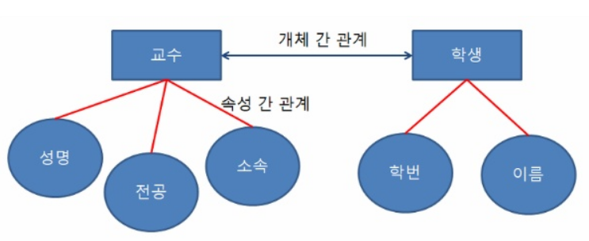

# [정보처리기사 074] - 데이터 모델의 구성 요소-관계(Relationship) ☆

# **# 관계(Relationship)**

**[관계의 정의]**

관계는 개체와 개체 사이의 논리적 연결을 의미한다.

관계에는 개체 간 관계와 속성 간 관계가 있다.

출처 : https://coding-factory.tistory.com/218

**[관계의 형태]**

· **일 대 일** : 개체 집합 A의 각 원소가 개체 집합 B의 원소 한 개와 대응하는 관계

· **일 대 다** : 개체 집합 A의 각 원소는 개체 집합 B의 원소 여러 개와 대응하고 있지만, 개체 집합 B의 각 원소는 개체 집합 A의 원소 한 개와 대응하는 관계

· **다 대 다** :개체 집합 A의 각 원소는 개체 집합 B의 원소 여러 개와 대응하고, 개체 집합 B의 각 원소도 개체 집합 A의 원소 여러 개와 대응하는 관계

**[관계의 종류]**

· 종속 **관계(Dependent Relationship)** : 두 개체 사이의 주종 관계를 표현한 것, 식별 관계와 비식별 관계가 있다.

​        \- **식별 관계(Identifying Relationship)** : 개체 A, B 사이의 관계에서 A 개체의 기본키가 B 개체의 외래키이면서 동시에 기본키가 되는 관계, B 개체의 존재 여부가 A 개체의 존재 여부에 의존적인 경우에 발생, ER 도형에서 실선으로 표시

​        \- **비식별 관계(Non-Identifying Relationship)** : 개체 A, B 사이의 관계에서 A 개체의 기본키가 B 개체의 비기본키 영역에서 외래키가 되는 관계, B 개체의 존재 여부는 A 개체의 존재 여부와 관계 없이 존재, ER 도형에서 점선으로 표시

· **중복 관계(Redundant Relationship)** : 두 개체 사이에 2번 이상의 종속 관계가 발생하는 관계

· **재귀 관계(Recursive Relationship)** : 개체가 자기 자신과 관계를 갖는 것, **순환 관계**라고도 함

· **배타 관계(Exclusive Relationship)** : 개체의 속성이나 구분자를 기준으로 개체의 특성을 분할하는 관계, 배타 AND와 배타 OR 관계로 구분, 배타 AND 관계는 하위 개체들 중 속성이나 구분자 조건에 따라 하나의 개체만 선택할 수 있고, 배타 OR 관계는 하나 이상의 개체를 선택할 수 있다.