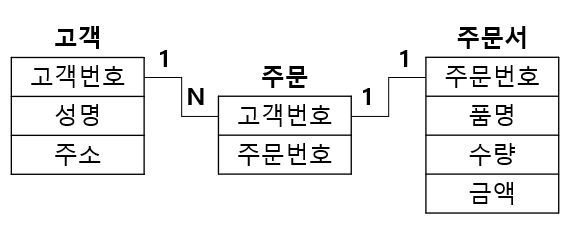

# [정보처리기사 076] - E-R(개체-관계) 모델 ★

# **# E-R(Entity-Relationship, 개체-관계) 모델**

**[E-R 모델의 개요]**

E-R 모델은 개념적 데이터 모델의 가장 대표적인 것이다.

개체(Entity Type)와 개체 간 관계(Relationship Type)를 기본 요소로 이용하여 현실 세계의 무질서한 데이터를 개념적 논리 데이터로 표현하기 위한 방법으로 많이 사용된다.

E-R 모델에서는 데이터를 개체, 관계, 속성으로 묘사한다.

E-R 모델은 특정 DBMS를 고려한 것은 아니다.

E-R 다이어그램으로 표현되며, 일대일, 일대다, 다대다 등의 관계 유형을 나타낸다.

**[E-R 다이어그램]**

E-R 모델의 기본 아이디어를 이해하기 쉽게 기호를 사용하여 시각적으로 표현한 그림이다.

실체 간의 관계는 물론, 시스템 내에서 역할을 가진 모든 실체(조직, 사용자, 프로그램, 데이터 등)들을 표현한다.

데이터에 대해 개발자, 관리자, 사용자들이 서로 다르게 인식하고 있는 View를 하나로 단일화 한다.

# **# E-R 다이어그램 표기법**

**[피터 첸 표기법(Peter Chen Notation)]**

​    \- 개체, 속성, 기본키 속성, 관계 등을 표한한다.

출처 : https://powerdev.tistory.com/37

출처 : https://powerdev.tistory.com/37

**[정보 공학 표기법( Notation)]**

​    \- 개체, 속성, 기본키 속성, 관계 등을 표현한다.

출처 : https://powerdev.tistory.com/37

​    \- 개체는 사각형 박스로, 개체명은 박스 바깥쪽 위에 표시한다.

​    \- 속성은 기본키 속성과 일반 속성으로 분리하여 표시한다.

​    \- 관계는 관계 표시 기호를 사용하여 표시한다.

출처 : https://powerdev.tistory.com/37

**[바커 표기법( Notation)]**

​    \- 개체, 속성, 기본키 속성, 관계 등을 표현한다.

​    \- 개체는 모서리가 둥근 박스로 표시하고, 박스 안 가장 위에 개체명을 표시한다.

​    \- 속성은 반드시 값이 저장되어야 하는 경우 *표시(mandatory)하고, 값이 저장될 수도 안될 수도 있는 경우 o표시(optional)한다.

​    \- 관계는 관계 표시 기호를 사용하여 표시 후 해당 개체의 역할을 동사 단어로 입력한다.

바커 엔티티 예, (출처 : http://m.blog.daum.net/eternal999/24?tp_nil_a=1)

바커 속성 예, (출처 http://m.blog.daum.net/eternal999/24?tp_nil_a=1)

Barker Conditional 작성 단계 예, (출처 : http://m.blog.daum.net/eternal999/24?tp_nil_a=1)
