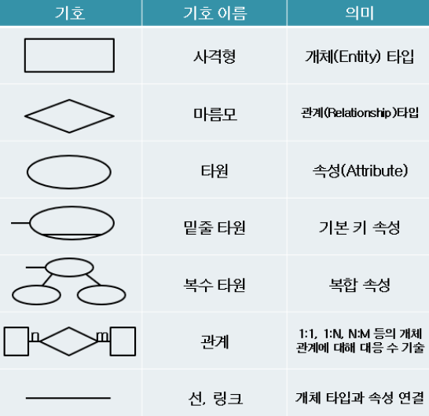

# [정보처리기사 077] - 관계형 데이터 모델

# **# 관계형 데이터 모델**

**[개요]**

· 가장 일반적인 구조의 데이터 모델로, 2차원 Table을 이용해 데이터 상호 관계를 정의하는 DB 구조를 말한다.

· 파일 구조처럼 구성한 테이블들을 하나의 DB로 묶어 테이블 내에 있는 속성 간의 관계를 설정하거나 테이블 간의 관계를 설정하여 이용한다.

· 기본키와 이를 참조하는 외래키로 데이터 간 관계를 표현한다.

· 계층 모델과 망 모델의 복잡한 구조를 단순화시킨 모델이다.

· 관계형 모델의 대표적 언어는 SQL이다.

· 일대일, 일대다, 다대다 관계를 자유롭게 표현할 수 있다.

**[구성]**

· '고객'과 '주문서'는 개체 테이블, '주문'은 관계로 만들어진 테이블

· 고객 테이블과 주문서 테이블은 주문 테이블을 관계로 연결되어 있다.

· 고객 테이블의 고객번호는 기본키, 주문 테이블의 고객번호와 주문번호는 외래키, 주문서 테이블의 주문번호는 기본키이다.

· 고객과 주문의 관계는 일대다, 즉, 한명의 고객은 여러 주문을 신청할 수 있다.

· 주문서와 주문의 관계는 일대일, 즉, 주문서는 주문번호 1개에 대한 정보만 갖는다.

· 주문 테이블 내용으로 주문 고객의 성명을 찾으려면 주문 테이블의 고객번호와 같은 고객번호를 고객 테이블에서 찾고, 주문 내역을 알려면 주문번호와 같은 주문번호를 주문서 테이블에서 찾는다.