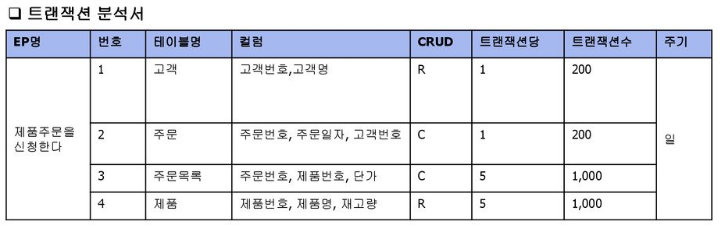
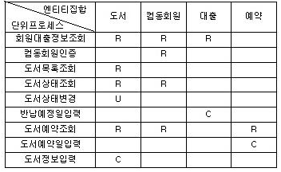

# [정보처리기사 087] - 트랜잭션 분석/CRUD 분석 ☆

# **# 트랜잭션**

**1) 트랜잭션 정의**

​    \- DB의 상태를 변환시키는 하나의 논리적 기능을 수행하기 위한 작업의 단위

​    \- 한번에 모두 수행되어야 할 일련의 연산들

​    \- DB 시스템에서 병행 제어 및 회복 작업 시 처리되는 작업의 논리적 단위로 사용

​    \- 사용자가 시스템에 대한 서비스 요구 시 시스템이 응답하기 위한 상태 변환 과정의 작업 단위로 사용

**2) 트랜잭션 특징**

​    \- 데이터 무결성을 보장하기 위해 DBMS의 트랜잭션이 가져야 할 특성

​    \- **원자성,** **Atomicity** : 트랜잭션 연산은 DB에 모두 반영되도록 완료(Commit)되거나 아니면 전혀 반영되지 않도록 복구(Rollback) 되어야 한다. 트랜잭션 내의 모든 명령은 반드시 완벽히 수행되어야 하며, 어느 하나라도 오류가 발생하면 전부 취소되어야 한다.

​    \- **일관성,** **Consistency** : 트랜잭션이 그 실행을 성공적으로 완료하면 언제나 일관성 있는 DB 상태로 변환한다. 시스템이 가지고 있는 고정 요소는 트랜잭션 수행 전과 완료 후의 상태로 같아야 한다.

​    \- **독립성,** **Isolation** : 둘 이상의 트랜잭션이 동시에 병행 실행되는 경우, 어느 하나의 트랜잭션 실행 중 다른 트랜잭션 연산이 끼어들 수 없다. 수행 중인 트랜잭션은 완전히 완료될 때까지 다른 트랜잭션에서 수행 결과를 참조할 수 없다.

​    \- **지속성,** **Durability** : 성공적으로 완료된 트랜잭션의 결과는 시스템이 고장나더라도 영구적으로 반영되어야 한다.

**3) 트랜잭션 분석**

​    \- CRUD 매트릭스를 기반으로 테이블에 발생하는 트랜잭션 양을 분석하는 목적이다.

​    \- 즉, 테이블에 저장되는 데이터 양을 유추하여 이를 근거로 DB 용량을 산정하고, 구로를 최적화하는 것이다.

​    \- 업무 개발 담당자가 수행한다.

​    \- 이를 통해 프로세스가 과도하게 접근하는 테이블을 확인하여 여러 디스크에 배치함으로써 디스크 입출력 분산을 통한 성능 향상을 도모한다.

**4) 트랜잭션 분석서**

​    \- 단위 프로세스와 CRUD 매트릭스를 이용하여 작성하고, 아래 6개의 구성 요소가 있다.

​    \- **단위** **프로세스** : 업무를 발생시키는 가장 작은 단위의 프로세스

​    \- **CRUD** **연산** : 프로세스의 트랜잭션이 DB 테이블에 영향을 주는 연산

​    \- **테이블** **명,** **컬럼** **명** : 프로세스가 접근하는 DB의 테이블 명과 컬럼 명

​    \- **테이블** **참조** **횟수** : 프로세스가 테이블을 참조하는 횟수

​    \- **트랜잭션** **수** : 주기별로 수행되는 트랜잭션 횟수

​    \- **발생** **주기** : 연, 분기, 월, 일, 시 등 트랝낵션 횟수를 측정하기 위한 발생 주기

출처 : https://slidesplayer.org/slide/14019317/

# **# CRUD**

**1) CRUD 분석**

​    \- Create + Read + Update + Delete

​    \- DB 테이블에 변화를 주는 트랜잭션의 CRUD 연산에 대해 CRUD 매트릭스를 작성하여 분석하는 것이다.

​    \- CRUD 분석으로 테이블에 발생되는 트랜잭션의 주기별 발생 횟수를 파악하고 연관된 테이블들을 분석하면, 테이블에 저장되는 데이터 양을 유추할 수 있다.

​    \- CRUD 분석을 통해 많은 트랜잭션이 몰리는 테이블을 파악할 수 있으므로 디스크 구성 시 유용한 자료로 활용할 수 있다.

​    \- 또한, 외부 프로세스 트랜잭션의 부하가 집중되는 DB 채널을 파악하고 분산시킴으로써 연결 지연이나 타임아웃 오류를 방지할 수 있다.

**2) CRUD 매트릭스**

​    \- 2차원 형태의 표, 행에는 프로세스 열에는 테이블을, 행과 열이 만나는 위치에는 프로세스가 테이블에 발생시키는 변화를 표시하는 업무 프로세스와 데이커 간 상관 분석표이다.

​    \- CRUD 매트릭스를 통해 프로세스의 트랜잭션이 테이블에 수행하는 작업을 검증한다.

​    \- 표의 각 셀에는 C/R/U/D의 앞 글자를 적고, 복수의 변화가 있으면 C>D>U>R의 우선순위를 적용한다.

​    \- C/R/U/D 중 어느 것도 적히지 않은 행/열, C/R이 없는 행을 확인하여 불필요하거나 누락된 테이블 또는 프로세스를 찾는다.

출처 : http://www.databaser.net/moniwiki/wiki.php/%ED%94%84%EB%A1%9C%EC%84%B8%EC%8A%A4%EB%AA%A8%EB%8D%B8%EB%A7%81%EA%B3%BCCRUD%EB%A7%A4%ED%8A%B8%EB%A6%AD%EC%8A%A4

