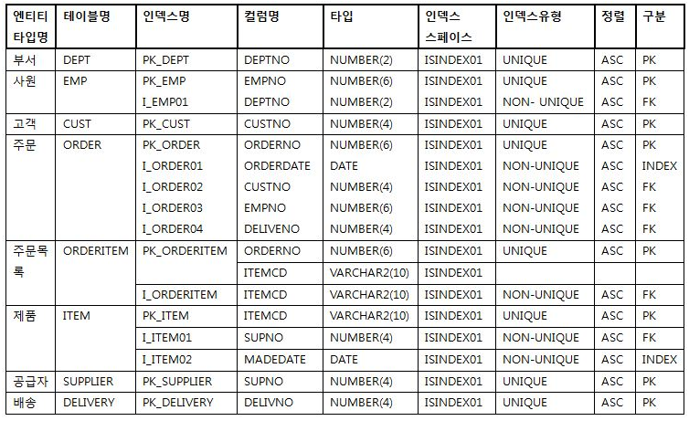

# [정보처리기사 088] - 인덱스 설계 ★

# **# 인덱스**

데이터 레코드에 빠르게 접근하기 위해 <키 값, 포인터>의 쌍으로 구성되는 데이터 구조.

· 데이터가 저장된 물리적 구조와 밀접한 관계가 있다.

· 레코드가 저장된 물리적 구조에 접근하는 방법을 제공한다.

· 인덱스를 통해 파일의 레코드에 대한 액세스를 빠르게 수행할 수 있다.

· 레코드 삽입/삭제가 수시로 일어나는 경우, 인덱스 개수를 최소화 하는 것이 효율적이다.

· 인덱스가 없으면 특정 값을 찾기 위해 TABLE SCAN* 발생한다.

​        cf) 테이블 스캔 : 테이블에 있는 모든 레코드를 순차적으로 읽는 것

· PK를 위한 인덱스를 기본 인덱스, 기본 인덱스가 아닌 인덱스들을 보조 인덱스라 한다.

· 대부분읜 DBMS에서는 모든 키에 대해 자동적으로 기본 인덱스를 생성한다.

· Clustered Index : 레코드의 물리적 순서가 인덱스의 엔트리 순서와 일치하게 유지되도록 구성되는 인덱스

# **#** 인덱스의 분류

1) **트리 기반 인덱스**

​    \- 인덱스를 저장하는 블록들이 트리 구조를 이루는 것

​    \- 상용 DBMS에서는 트리 구조 기반의 B+ 트리 인덱스를 주로 활용

​    \- **B 트리 인덱스**

​        · 일반적으로 사용되는 인덱스 방식

​        · 루트 노드에서 하위노드로 나아가면서 키 값의 크기를 비교해 단말 노드에서 찾고자 하는 데이터를 검색

​        · 키 값과 레코드를 가리키는 포인터들이 트리 노드에 오름차순으로 저장

​        · 모든 리프 노드는 같은 레벨에 있다.

​    \- **B+ 트리 인덱스**

​        · B 트리의 변형, 인덱스 세트(단말 노드가 아닌 노드로 구성)와 순차 세트(단말 노드로만 구성)로 구분

​        · 인덱스 세트에 있는 노드들은 단말 노드에 있는 키 값을 찾아갈 수 있는 경로로 제공

​        · 순차 세트에 있는 단말 노드가 해당 데이터 레코드의 주소를 가리킴

​        · 인덱스 세트에 있는 모든 키 값이 단말 노드에 다시 나타나므로 단말 노드만을 이용한 순차 처리 가능

2) **비트맵 인덱스**

​    \- 인덱스 컬럼의 데이터를 Bit 값인 0 또는 1로 변환하여 인덱스 키로 사용

​    \- 데이터가 Bit로 구성되어 효율적인 논리 연산이 가능하며 저장 공간이 작음

​    \- 키 값을 포함하는 로우의 주소를 제공하는 것이 목표

​    \- 비트맵 인덱스는 분포도가 좋은 컬럼에서 성능 향상에 효과적이며, 다중 조건을 만족하는 튜플 개수 계산에 적합, 또한 동일한 값이 반복되는 경우에 압축 효율 우수

​    \- 데이터가 Bit로 구성되어 효율적인 논리 연산이 가능하며 저장 공간이 작음

3) **함수 기반 인덱스**

​    \- 컬럼 값 대신 컬럼에 특정 함수나 수식을 적용해 산출된 값을 사용하는 것

​    \- B+ 트리 인덱스 또는 비트맵 인덱스를 생성하여 사용

​    \- 데이터를 입력하거나 수정할 때 함수를 적용하기 때문에 부하 발생 가능

​    \- 사용하는 함수가 사용자 정의 함수일 경우 시스템 함수보다 부하가 큼

​    \- 대소문자, 띄어쓰기 등 상관없이 조회할 때 유용하게 사용

​    \- 적용 함수 종류 : 산술식, 사용자 정의 함수, PL/SQL 함수, Package, C callout 등

4) **비트맵 조인 인덱스**

​    \- 다수의 조인된 객체로 구성된 인덱스

​    \- 단일 객체로 구성된 일반적 인덱스와 다른 액세스 방법

​    \- 비트맵 인덱스와 물리적 구조가 동일

5) **도메인 인덱스**

​    \- 개발자가 필요한 인덱스를 직접 만들어 사용하는 것

​    \- 확장형 인덱스라고도 함

# **# 인덱스 설계**

확실히 드러난 컬럼에 대해 기본적인 인덱스를 먼저 지정하고, 개발 단계에서 필요한 인덱스 설계를 반복적으로 진행한다.

**인덱스 설계 순서**

​    1) 인덱스의 대상 테이블이나 컬럼 등을 선정

​    2) 인덱스의 효율성을 검토하여 인덱스 최적화 수행

​    3) 인덱스 정의서 작성

인덱스 정의서 / 출처 : http://wiki.gurubee.net/pages/viewpage.action?pageId=14024898

**인덱스 대상 테이블 선정 기준**

​    \- MULTI BLOCK READ* 수에 따라 판단

​        cf) M B R : 테이블 액세스 시 메모리에 한 번에 읽어 들일 수 있는 블록으 수

​    \- 랜덤 액세스가 빈번한 테이블

​    \- 특정 범위나 특정 순서로 데이터 조회가 필요한 테이블

​    \- 다른 테이블과 순차적 조인이 발생되는 테이블

**인덱스 대상 컬럼 선정 기준**

​    \- 인덱스 컬럼의 분포도가 10~15% 이내인 컬럼

​        cf) 분포도 = (컬럼 값의 평균 Row 수 / 테이블의 총 Row 수 ) * 100

​    \- 분포도가 10~15% 이상이어도 부분 처리를 목적으로 하는 컬럼

​    \- 입출력 장표에서 조회 및 출력 조건으로 사용되는 컬럼

​    \- 인덱스가 자동 생성되는 기본키와 Unique 키 제약 조건을 사용한 컬럼

​    \- 가능한 한 수정이 빈번하지 않은 컬럼

​    \- ORDER BY, GROUP BY, UNION이 빈번한 컬럼

​    \- 분포도가 좁은 컬럼은 단독 인덱스로 생성

​    \- 인덱스들이 자주 조합되어 사용되는 경우 하나의 인덱스로 생성

**인덱스 설계 시 고려사항**

​    \- 새로 추가되는 인덱스는 기존 액세스 경로에 영향을 줄 수 있다.

​    \- 인덱스를 지나치게 많이 만들면 오버헤드가 발생한다.

​    \- 넓은 범위를 인덱스로 처리하면 많은 오버헤드가 발생한다.

​    \- 인덱스를 만들면 추가적인 저장 공간이 필요하다.

​    \- 인덱스와 테이블 데이터의 저장 공간이 분리되도록 설계한다.