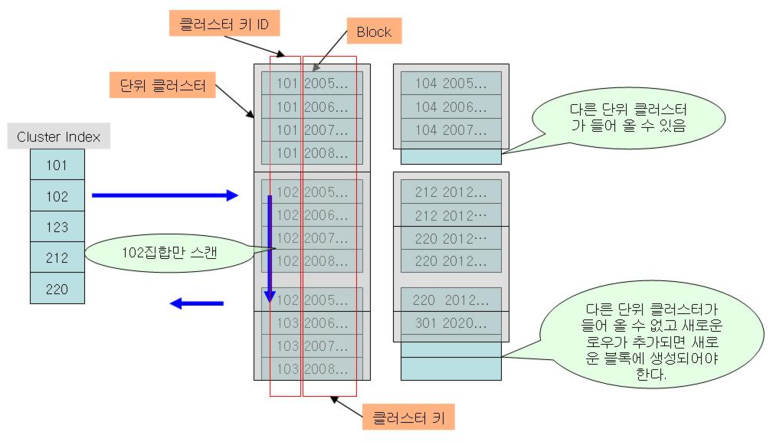

# [정보처리기사 089] - 뷰(View) 설계 ★

# **# 클러스터(Cluster)**

**1) 개요**

· 클러스터는 데이터 저장 시 데이터 액세스 효율을 향상시키기 위해 동일한 성격의 데이터를 동일한 데이터 블록에 저장하는 물리적 저장 방식이다.

· 클러스터링 키*로 지정된 컬럼 값의 순서대로 저장되고, 여러 테이블이 하나의 클러스터에 저장된다.

​    cf) Clustering Key : 클러스터링 된 테이블에서 각 행에 접근할 때 기준이 되는 열

클러스터링 테이블 예시 / 출처 : http://wiki.gurubee.net/pages/viewpage.action?pageId=1507448

**2) 특징**

· 클러스터링 된 테이블은 데이터 조회 속도는 향상되지만, 데이터 입력/수정/삭제에 대한 성능은 저하된다.

· 데이터 분포도가 넓은 테이블일수록 클러스터가 유리하고, 저장 공간을 절약할 수 있다.

· 클러스터링 된 테이블은 클러스터링 키 열을 공유하기 때문에 저장 공간이 줄어든다.

· 대용량을 처리하는 트랜잭션은 전체 테이블을 스캔하는 일이 잦기 때문에 클러스터링 하지 않는 것이 효율적이다.

· 처리 범위가 넓은 경우에는 단일 테이블 클러스터링, 조인이 많이 발생하는 경우에는 다중 테이블 클러스터링을 사용한다.

· 파티셔닝 된 테이블에는 클러스터링을 할 수 없다.

· 클러스터링 결과, 비슷한 데이터끼리 동일한 데이터 블록에 저장되기 때문에 디스크 I/O가 줄어든다.

· 클러스터링 된 테이블에 클러스터드 인덱스를 생성하면 접근 성능이 향상된다.

**3) 클러스터 대상 테이블**

· 분포도가 넓은 테이블

· 대량의 범위를 자주 조회하는 테이블

· 입력/수정/삭제가 자주 발생하지 않는 테이블

· 자주 조인되어 사용되는 테이블

· ORDER BY, GROUP BY, UNION이 잦은 테이블