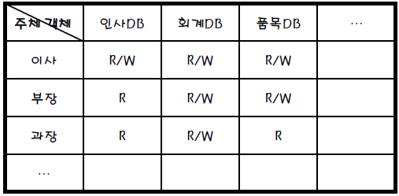

# [정보처리기사 096] - 데이터베이스 보안-접근통제 ★

# **# 접근 통제**

**[개요]**

· 데이터가 저장된 객체와 이를 사용하려는 주체 사이의 정보 흐름을 제한하는 것

· 데이터에 대해 아래 행위를 통제 함으로써, 자원의 불법적인 접근 및 파괴를 예방

​    \- 비인가 된 사용자의 접근 감시

​    \- 접근 요구자의 사용자 식별 및 요구 정당성 확인 및 기록

​    \- 보안 정책에 근거한 접근의 승인 및 거부

· **임의 접근 통제**

​    \- DAC, Discretionary Access Control

​    \- 데이터에 접근하는 사용자 신원에 따라 접근 권한을 부여하는 방식

​    \- 통제 권한이 주체에 있기 때문에 주체가 접근통제 권한을 지정 및 제어

​    \- 일반적으로 특정 객체에 대한 조작 권한은 DBMS로부터 부여 받지만, DAC에서는 객체를 생성한 사용자가 생성한 객체에 대한 모든 권한을 부여받고, 그 권한을 다른 사용자에게 허가

​    \- DAC에 사용되는 SQL 명령어에는 GRANK, REVOKE

· **강제 접근 통제**

​    \- MAC, Mandatory Access Control 

​    \- 주체와 객체의 등급을 비교하여 접근 권한을 부여하는 방식

​    \- 제 3자가 접근통제 권한을 지정

​    \- DB 객체 별로 보안 등급 부여, 사용자 별로 인가 등급 부여

​    \- 주체는 자신보다 높은 등급의 객체에 대해 읽기/수정/등록이 모두 불가, 같은 등급인 객체에 대해서는 읽기/수정/등록 가능, 낮은 객체에는 읽기만 가능

**[접근 통제의 3요소]**

​    1) **접근 통제 정책**

​    2) **접근 통제 매커니즘**

​    3) **접근 통제 보안 모델**

# **# 정책**

어떤 주체가, 언제, 어디서, 어떤 객체에게, 어떤 행위에 대한 허용 여부를 정의하는 것

1) **신분 기반 정책**

​    \- 주체/그룹의 신분에 근거하여 객체의 접근을 제한하는 방법

​    \- **IBP**(Individual-Based Policy) : 최소 권한 정책, 단일 주체에게 하나의 객체에 대한 허가 부여

​    \- **GBP**(Group-Based Policy) : 복수 주체에게 하나의 객체에 대한 허가 부여

2) **규칙 기반 정책**

​    \- 주체가 갖는 권한에 근거하여 객체의 접근을 제한하는 방법

​    \- **MLP**(Multi-Level Policy) : 사용자 및 객체 별로 지정된 기밀 분류에 따른 정책

​    \- **CBP**(Compartment-Based Policy) : 집단 별로 지정된 기밀 허가에 따른 정책

3) **역할 기반 정책**

​    \- GBP 변형된 정책, 주체의 신분이 아니라 주체가 맡은 역할에 근거하여 객체의 접근을 제한

# **# 매커니즘**

정의된 접근통제 정책을 구현하는 기술적인 방법

· **접근 통제 목록** : 객체를 기준으로 특정 객체에 대해 어떤 주체가 어떤 행위를 할 수 있는지 기록한 문서

· **능력 리스트** : 주체를 기준으로 주체에게 허가된 자원 및 권한을 기록한 목록

· **보안 등급** : 주체나 객체 등에 부여된 보안 속성의 집합, 이를 기반으로 접근 승인 여부 결정

· **암호화** : 데이터를 보낼 때 지정된 수신자 외에는 내용을 알 수 없도록 평문을 암호문으로 변환하는 것, 무단 도용을 방지하기 위해 주로 사용

# **# 접근 통제 보안 모델**

보안 정책을 구현하기 위한 정형화 된 모델

**[기밀성 모델]**

군사적인 목적으로 개발된 최초의 수학적 모델, 기밀 보장이 최우선인 모델

| **Level**     | **단순 보안 규칙** | **스타 - 보안 규칙** | **강한 스타 보안 규칙** |
| ------------- | ------------------ | -------------------- | ----------------------- |
| **읽기 권한** | **쓰기 권한**      | **읽기/쓰기 권한**   |                         |
| **높은 등급** | 통제               | 가능                 | 통제                    |
| **같은 등급** | 가능               | 가능                 | 가능                    |
| **낮은 등급** | 가능               | 통제                 | 통제                    |

· 단순 보안 규칙 :주체는 자신보다 높은 등급의 객체을 읽을 수 없다.

· 스타 보안 규칙 : 주체는 자신보다 낮은 등급의 객체에 정보를 쓸 수 없다.

· 강한 스타 보안 규칙 : 주체는 자신과 등급이 다른 객체를 읽거나 쓸 수 없다.

**[무결성 모델]**

기밀성 모델에서 발생하는 불법 정보 변경을 방지하기 위해 개발된 모델

· 데이터 일관성 유지에 중점을 두어 개발 됨

· 기밀성 모델과 동일하기 주체 및 객체의 보안 등급을 기반으로 함

| **Level**     | **단순 무결성 규칙** | **스타 - 무결성 규칙** |
| ------------- | -------------------- | ---------------------- |
| **읽기 권한** | **쓰기 권한**        |                        |
| **높은 등급** | 가능                 | 통제                   |
| **같은 등급** | 가능                 | 가능                   |
| **낮은 등급** | 통제                 | 가능                   |

· 단순 무결성 규칙 : 주체는 자신보다 낮은 등급의 객체를 읽을 수 없다.

· 스타 무결성 규칙 : 주체는 자신보다 높은 등급의 객체에 정보를 쓸 수 없다.

**[접근통제 모델]**

접근통제 매커니즘을 보안 모델로 발전시킨 것

· 접근통제 행렬이 가장 대표적이며, 임의의 접근 통제를 관리하기 위한 보안 모델이다

​    \- 행(주체)과 열(객체)로 권한 유형을 나타낸다

​    \- 행 : 주체로서 객체에 접근을 시도하는 사용자

​    \- 열 : 객체로서 접근 통제가 이뤄지는 테이블, 컬럼, 뷰 등과 같은 DB의 개체

​    \- 규칙 : 주체가 객체에 대하여 수행하는 입력/수정/삭제 등의 DB에 대한 조작

접근통제 행렬모델 예시 / 출처 : https://m.blog.naver.com/sujunghan726/220315130644

# **# 조건**

접근 통제 매커니즘의 취약점을 보완하기 위해 접근 통제 정책에 부가하여 적용할 수 있는 조건

· **값 종속 통제(Value Dependent Control)** : 일반적으로는 객체에 저장된 값에 상관없이 접근 통제를 동일하게 적용하지만, 객체에 저장된 값에 따라 다른 통제를 허용해야 하는 경우 사용한다.

​    ex) 납입 금액에 따라 보안 등급이 설정되고, 이에 따라 접근 여부가 결정되는 경우

· **다중 사용자 통제(Multi User Control)** : 지정된 객체에 다수의 사용자가 동시에 접근을 요구하는 경우에 사용한다.

​    ex) 여러 명으로 구성된 한 팀에서 다수결에 따라 접근 여부가 결정되는 경우

· **문맥 기반 통제(Context Based Control)** : 특정 시간, 네트워크 주소, 접근 경로, 인증 수준 증에 근거하여 접근을 제어하는 방법, 다른 보안 정책과 결합하여 보안 시스템의 취약점을 보완할 때 사용된다.

​    ex) 근무시간 사이에만 접근 가능하도록 설정

# **# 감사 추적**

애플리케이션이 DB에 접근하여 수행한 모든 활동을 기록하는 기능

· 오류가 발생한 DB를 복구하거나 부적절한 데이터 조작을 파악하기 위해 사용

· 실행한 프로그램, 사용자, 날짜 및 시간, 접근한 데이터의 이전/이후 값 등이 저장됨