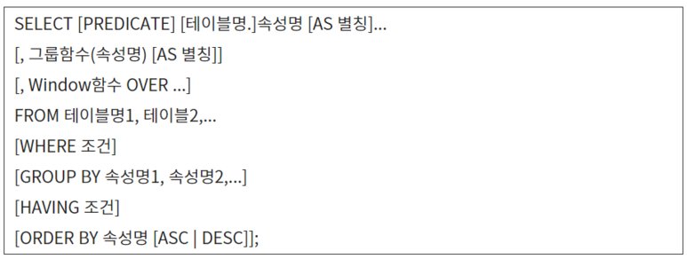

# [정보처리기사 105] - DML-SELECT-1 ★

# # 일반 형식

출처 : https://liveyourit.tistory.com/222

**[SELECT 절]**

  · PREDICATE : 불러올 튜플 수를 제한할 명령어

​    \- ALL : 모든 튜플 검색, 디폴트 설정이기 때문에 주로 생략

​    \- DISTINCT : 중복된 튜플이 있으면 그 중 첫 번째 한 개만 검색

​    \- DISTINCTROW : 중복된 튜플을 제거하고 한 개만 검색하지만, 선택된 속성의 값이 아닌, 튜플 전체를 대상으로 한다.

  · 속성명 : 검색하여 불러올 속성(열) 또는 속성을 이용한 수식 지정

​    \- 기본 테이블을 구성하는 모든 속성을 지정할 때 '*' 사용

​    \- 두 개 이상의 테이블을 대상으로 검색할 때, '테이블명.속성명'으로 표현

  · AS : 속성 및 연산의 이름을 다른 제목으로 표시하기 위해 사용

**[FROM 절]**

  · 쿼리에 의해 검색될 데이터들을 포함하는 테이블 명

**[WHERE 절]**

  · 검색할 조건 기술

**[ORDER BY 절]**

  · 특정 속성을 기준으로 정렬하여 검색할 때 사용

​    \- 속성명 : 정렬의 기준이 되는 속성명 기술

​    \- ASC/DESC : 정렬 방식, ASC는 오름차순(디폴트), DESC는 내림차순

\+ **LIKE 연산자**

  · 대표 문자를 이용해 지정된 속성 값이 문자 패턴과 일치하는 튜플을 검색하기 위해 사용

​    \- % : 모든 문자를 대표

​    \- _ : 문자 하나를 대표

​    \- # : 숫자 하나를 대표

# **# 기본 검색**

<사원> 테이블의 모든 튜플을 검색하시오.

*SELECT \* FROM 사원;*

*SELECT 사원.\* FROM 사원;*

*SELECT 이름, 부서, 생일, 주소, 기본급 FROM 사원;*

*SELECT 사원.이름, 사원.부서, 사원.생일, 사원.주소, 사원.기본급 FROM 사원;*

<사원> 테이블에서 '주소'만 검색하되, 같은 '주소'는 한 번만 출력하시오.

*SELECT DISTINCT 주소 FROM 사원;*

<사원> 테이블에서 '기본급'에 특별수당 10을 더한 월급을 "**부서의 ***의 월급 ***" 형태로 출력하시오.

*SELECT 부서+'부서의' AS 부서2, 이름+'의 월급' AS 이름2, 기본급+10 AS 기본급2 FROM 사원;*

# **# 조건 지정 검색**

<사원> 테이블에서 '기획'부서의 모든 튜플을 검색하시오.

*SELECT \* FROM 사원 WHERE 부서='기획';*

<사원> 테이블에서 '기획'부서에 근무하면서 "대흥동"에 사는 사람의 튜플을 검색하시오.

*SELECT \* FROM 사원 WHERE 부서='기획' AND 주소='대흥동';*

<사원> 테이블에서 '부서'가 '기획'이거나 '인터넷'인 튜플 검색하시오.

*SELECT \* FROM 사원 WHERE 부서='기획' OR 부서='인터넷';*

<사원> 테이블에서 성이 '김'인 사람의 튜플 검색하시오.

*SELECT \* FROM 사원 WHERE 이름 LIKE "김%";*

<사원> 테이블에서 '생일'이 '01/01/69'에서 '12/31/73' 사이인 튜플을 검색하시오.

*SELECT \* FROM 사원 WHERE 생일 BETWEEN [#01](https://blog.naver.com/PostListByTagName.nhn?blogId=handuelly&encodedTagName=01)/01/69# AND [#12](https://blog.naver.com/PostListByTagName.nhn?blogId=handuelly&encodedTagName=12)/31/73#;*

​    · 날짜 데이터는 숫자로 취급하지만, '' 또는 ##로 묶는다.

<사원> 테이블에서 '주소'가 NULL인 튜플을 검색하시오.

*SELECT \* FROM 사원 WHERE 주소 IS NULL;*

# **# 정렬 검색**

<사원> 테이블에서 '주소'를 기준으로 내림차순으로 정렬해서 상위 2개 튜플만 검색하시오.

*SELECT TOP 2 \* FROM 사원 ORDER BY 주소 DESC;*

<사원> 테이블에서  '부서'를 기준으로 오름차순으로 정렬하고, 같은 '부서'에 대해서는 '이름'을 기준으로 내림차순 정렬시켜 검색하시오.

*SELECT \* FROM 사원 ORDER BY 부서 ASC, 이름 DESC;* 

# **# 하위 질의**

'취미'가 '나이트댄스'인 사원의 '이름'과 '주소'를 검색하시오.

*SELECT 이름, 주소 FROM 사원 WHERE 이름 = (*

​    *SELECT 이름 FROM 여가활동 WHERE 취미 = '나이트댄스'*

*);*

취미활동을 하지 않는 사원들을 검색하시오.

*SELECT \* FROM 사원 WHERE 이름 NOT IN (*

​    *SELECT 이름 FROM 여가활동*

*);*

# **# 복수 테이블 검색**

'경력'이 10년 이상인 사원의 '이름', '부서', '취미', '경력'을 검색하시오.

*SELECT 사원.이름 사원.부서, 여가활동.취미, 여가활동.경력*

*FROM 사원, 여가활동*

*WHERE 여가활동.경력 >= 10 AND 사원.이름 = 여가활동.이름;*