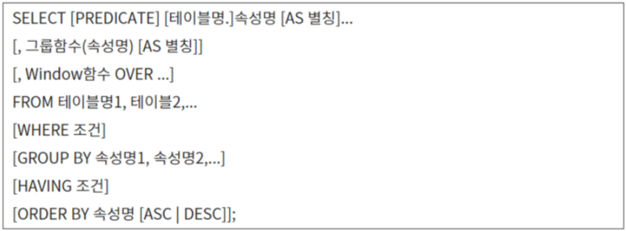

# [정보처리기사 106] - DML-SELECT-2 ★

# # 일반 형식

출처 : https://liveyourit.tistory.com/222

**[그룹 함수]**

· GROUP BY 절에 지정된 그룹 별로 속성 값을 집계할 함수 기술 

​    \- COUNT(속성명) : 그룹별 튜플 수를 구하는 함수

​    \- SUM(속성명) : 그룹별 합계를 구하는 함수

​    \- AVG(속성명) : 그룹별 평균을 구하는 함수

​    \- MAX/MIN(속성명) : 그룹별 최대/최소 값을 구하는 함수

​    \- STDDEV(속성명) : 그룹별 표준편차를 구하는 함수

​    \- VARIANCE(속성명 : 그룹별 분산을 구하는 함수

​    \- ROLLUP(속성명1, 속성명2, ...) : 인수로 주어진 속성을 대상으로 그룹별 소계를 구하는 함수, 속성의 개수가 n개이면 n+1까지, 하위레벨에서 상위레벨 순으로 데이터 집계

​    \- CUBE(속성명1, 속성명2, ...) : 인수로 주어진 속성을 대상으로 모든 조합의 그룹별 소계를 구하는 함수, 속성 n개에 대해 n^2 레벨까지, 상위레벨에서 하위레벨 순으로 데이터 집계

**[WINDOW 함수]**

· GROUP BY 절을 사용하지 않고 속성 값을 집계할 함수 기술

· PARTITION BY : WINDOW 함수가 적용될 범위로 사용할 속성 지정

· ORDER BY : PARTITION 안에서 정렬 기준으로 사용할 속성 지정

​    \- ROW_NUMBER() : 윈도우 별 각 레코드에 대한 일련 번호 반환

​    \- RANK() : 운도우별로 순위 반환, 공동 순위 반영

​    \- DENSE_RANK() : 윈도우별로 순위 반환, 공동 순위는 무시하고 순위 부여

**[GROUP BY 절]**

· 특정 속성을 기준으로 그룹화하여 검색할 때 사용

· 일반적으로, GROUP BY 절은 그룹 함수와 함께 사용

**[HAVING 절]**

· GROUP BY 절과 함께 사용되며, 그룹에 대한 조건을 지정

# **# WINDOW 함수 이용 검색**

<상여금> 테이블에서 '상여내역'별로 '상여금'에 대한 일련 번호를 구하시오.(단, 순서는 내림차순이며, 속성명으 'NO'로 할 것)

*SELECT 상여내역, 상여금*

*ROW_NUMBER() OVER (PARTITION BY 상여내역 ORDER BY 상여금 DESC) AS NO*

*FROM 상여금;*

<상여금> 테이블에서 '상여내역'별로 '상여금'에 대한 순위를 구하시오.(단, 순서는 내림차순이며, 속성명은 '상여금순위'로 하고, RANK() 함수를 이용할 것)

*SELECT 상여내역, 상여금*

*RANK() OVER (PARTITION BY 상여내역 ORDER BY 상여금 DESC) AS 상여금순위*

*FROM 상여금;*

# **# 그룹 지정 검색**

<상여금> 테이블에서 '부서'별 '상여금' 평균을 구하시오.

*SELECT 부서, AVG(상여금) AS 평균*

*FROM 상여금 GROUP BY 부서;*

<상여금> 테이블에서 부서별 튜플 수를 검색하시오.

*SELECT 부서, COUNT(\*) AS 사원수*

*FROM 상여금 GROUP BY 부서;*

<상여금> 테이블에서 '상여금'이 100 이상인 사원이 2명 이상인 '부서'의 튜플 수를 구하시오.

*SELECT 부서, COUNT(\*) AS 사원수*

*FROM 상여금 WHERE 상여금 >= 100 GORUP BY 부서 HAVING COUNT(\*) >= 2;*

<상여금> 테이블의 '부서', '상여내역', '상여금'에 대해 부서별 상여내역별 소계와 전체 합계를 검색하시오.(단, 속성명은 '상여금합계'로 하고, ROLLUP 함수를 사용할 것)

*SELECT 부서, 상여내역, SUM(상여금) AS 상여급합계*

*FROM 상여금 GROUP BY ROLLUP(부서, 상여내역)*

<상여금> 테이블의 '부서', '상여내역', '상여금'에 대해 부서별 상여내역별 소계와 전체 합계를 검색하시오.(단, 속성명은 '상여급합계'로 하고, CUBE 함수를 사용할 것)

*SELECT 부서, 상여내역, SUM(상여금) AS 상여급합계*

*FROM 상여금 GROUP BY CUBE(부서, 상여내역);*

# **# 집합 연산자를 통한 질의**

2개 이상의 테이블의 데이터를 하나로 통합한다.

두 개의 SELECT문에 기술한 속성들은 개수와 데이터 유형이 서로 동일해야 한다.

**[집합 연산자]**

· UNION : 합집합, 두 SELECT 문의 조회 결과를 통합하여 모두 출력하되, 중복 행은 한번만 출력한다.

· UNION ALL : 합집합, 두 SELECT 문의 조회 결과를 통합하여 모두 출력하되, 중복 행도 그대로 출력한다.

· INTERSECT : 교집합, 두 SELECT 문의 조회 결과 중 공통된 행만 출력한다.

· EXCEPT : 차집합, 첫 SELECT 문의 조회 결과에서 두번째 SELECT 문의 조회 결과를 제외한 행을 출력한다.

<사원> 테이블과 <직원> 테이블을 통합하는 질의문을 작성하시오.(단, 같은 레코드가 중복되어 나오지 않게 하시오.)

*SELECT \* FROM 사원*

*UNION*

*SELECT \* FROM 직원*

<사원> 테이블과 <직원> 테이블에 공통으로 존재하는 레코드만 통합하는 질의문을 작성하시오.

*SELECT \* FROM 사원*

*INTERSECT*

*SELECT \* FROM 직원*