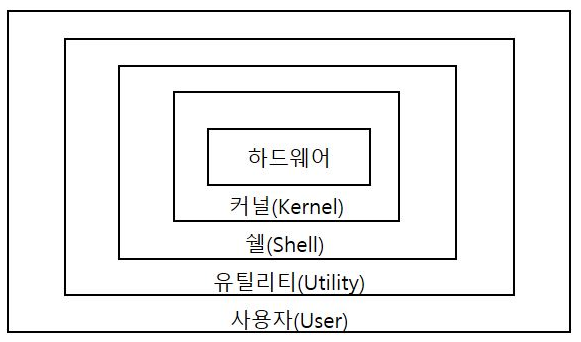

# [정보처리기사 143] - UNIX/LINUX/MacOS ★

# **#** UNIX

**※ 개요 및 특징**

· AT&T 벨 연구소, MIT, GE 공동 개발

· 시분할 시스템(Time Sharing System)을 위해 설계된 대화식 OS

· 오픈 소스 시스템

· C 언어 기반으로 이식성이 높고, 장치 및 프로세스 간 호환성이 높음

· 크기가 작고 이해하기 쉬움

· Multi-User, Multi-Tasking 지원

· 많은 네트워킹 기능을 제공하므로 네트워크 관리용 OS로 적합

· 트리 구조의 파일 시스템

· 전문적인 프로그램 개발에 용이

· 다양한 유틸리티 프로그램 존재

**※ UNIX 시스템 구성**

출처 : https://wondong2.tistory.com/22

· Kernel

​    \- UNIX의 핵심, 주기억장치에 적재된 후 컴퓨터 부팅 시 실행

​    \- HW 보호 및 프로그램과 HW 간 인터페이스 역할 담당

​    \- 다양한 기능*(CPU 스케줄링, 기억장치 관리, 파일 관리, 입출력 관리, 프로세스 간 통신, 데이터 전송 및 변환 등)* 수행

· Shell

​    \- 시스템과 사용자 간 인터페이스를 담당하는 명령어 해석기*(사용자 명령을 인식하여 프로그램 호출 및 명령 수행)*

​    \- 명령어가 포함된 파일 형태로 보조 기억장치에서 존재

​    \- 파이프라인*(둘 이상의 명령을 함께 묶어 처리한 결과를 다른 명령의 입력으로 전환)* 기능 지원

​    \- 입출력 재지정을 통해 출력과 입력의 방향 변경 가능

​    \- 공용 Shell(Bourne, C, Korn)이나 사용자 자신이 만든 Shell 사용 가능

· Utility

​    \- 일반 사용자가 작성한 응용 프로그램을 처리하는 데 사용

​    \- DOS에서의 외부 명령어에 해당

​    \- 에디터, 컴퍼일러, 인터프리터, 디버거 등

**※ UNIX에서의 프로세스 간 통신**

· Signal : 간단한 메시지를 이용하여 통신하는 것, 초기 UNIX 시스템에서 사용

· Pipe : 한 프로세스의 출력이 다른 프로세스의 입력으로 사용되는 단방향 통신 방식

· Socket : 프로세스 사이의 대화를 가능하게 하는 쌍방향 통신 방식

# **#** LINUX

**※ 개요 및 특징**

· 1991년 Linus Torvalds가 UNIX 기반으로 개발

· 오픈소스기 때문에 기능 추가, 설치 및 사용, 재배포 가능

· UNIX와 완벽하게 호환 가능하며, 대부분의 특징이 UNIX와 동일

# **#** MacOS

**※ 개요 및 특징**

· 1980년대 Apple이 UNIX 기반으로 개발

· iMAC, MacBook 등의 애플 제품에서만 사용 가능

· 드라이버 설치 및 제거 과정이 단순