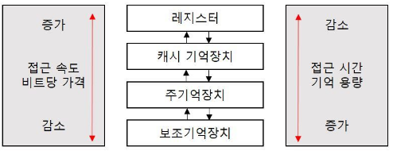

# [정보처리기사 144] - 기억장치 관리의 개요 ★

# **# 기억장치 계층 구조**

**※ 특징**

출처 : https://wondong2.tistory.com/19

· 상위 기억장치일수록 접근 속도와 시간이 빠르지만, 기억용량이 적고 비용이 높다.

· 주기억장치는 각자 자신의 주소를 갖는 워드/바이트들로 구성되어 있고, 주소를 이용하여 액세스한다.

· 보조기억장치의 데이터는 주기억장치에 적재된 후 CPU에 의해 액세스된다.

· 레지스터, 캐시, 주기억장치의 프로그램과 데이터는 CPU가 직접 액세스할 수 있다.

# **# 기억장치 관리 전략**

**※ 개요**

· 보조기억장치의 프로그램이나 데이터를 주기억장치에 적재시키는 시기, 위치 등을 지정하여 한정된 주기억장치의 공간을 효율적으로 사용시키기 위한 것

**※ 반입 전략, Fetch**

· '언제' 주기억장치로 적재할 것인지 결정하는 전략

· 요구 반입 : Demand Fetch, 실행 중인 프로그램이 특정 프로그램이나 데이터 등의 참조를 요구할 때 적재하는 방법

· 예상 반입 : Anticipatory Fetch, 실행중인 프로그램에 의해 참조될 프로그램이나 데이터를 미리 예상하여 적재하는 방법

**※ 배치 전략, Placemnet**

· 주기억장치의 '어디에' 위치시킬 것인지 결정하는 전략

· 최초 적합 : First Fit, 들어갈 수 있는 크기의 빈 영역 중에서 첫 번째 분할 영역에 배치

· 최적 적합 : Best Fit, 들어갈 수 있는 크기의 빈 영역 중에서 단편화*를 가장 작게 남기는 분할 영역에 배치

· 최악 적합 : Worst Fit, 들어갈 수 있는 크기의 빈 영역 중에서 단편화를 가장 많이 남기는 분할 영역에 배치

​    cf) 단편화 : 주기억장치의 분할된 영역에 프로그램이나 데이터를 할당할 경우, 분할된 영역이 프로그램이나 데이터보다 작거나 커서 생기는 빈 기억 공간을 의미

**※ 교체 전략, Replacement**

· 주기억장치의 모든 영역이 이미 모두 사용중인 상태에서 새로운 프로그램/데이터를 배치하려고 할 때, 어느 영역을 교체할 것인지 결정하는 전략

· 방법 : FIFO, OPT, LRU, LFU, NUR, SCR 등