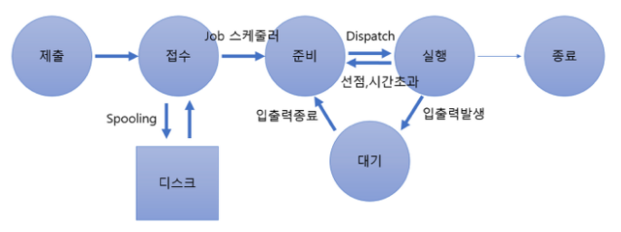

# [정보처리기사 148] - 프로세스의 개요 ★

# **# 프로세스**

**※ 정의**

· 프로세서(CPU)에 의해 처리되는 사용자 및 시스템 프로그램 등 실행 중인 프로그램

· PCB를 가진 프로그램

· 실기억장치에 저장된 프로그램

· 프로시저가 활동 중인 것

· 프로세서가 할당되는 실체로서, 디스패치가 가능한 단위

· 운영체제가 관리하는 실행 단위

· 비동기적 행위를 일으키는 주체

· 지정된 결과를 얻기 위한 일련의 계통적 동작

· 목적 또는 결과에 따라 발생되는 사건들의 과정

**※ PCB(Process Control Block)**

· OS가 프로세스에 대한 중요 정보를 저장해 놓는 곳

· 각 프로세스가 생성될 때마다 고유의 PCB가 생성되고, 프로세스 완료 시 PCB는 제거

· PCB에 저장되어 있는 정보

​    \- 프로세스의 현재 상태 : 준비/대기/실행 등의 프로세스 상태

​    \- 포인터 : 부모/자식 프로세스에 대한 포인터(부모/자식 프로세스의 주소 기억), 프로세스가 위치한 메모리에 대한 포인터(현재 프로세스가 위치한 주소 기억), 할당된 자원에 대한 포인터(프로세스의 각 자원에 대한 주소 기억)

​    \- 프로세스 고유 식별자 : 프로세스를 구분할 수 있는 고유의 번호

​    \- 스케줄링 및 프로세스의 우선순위 : 스케줄링 정보 및 프로세스 실행 우선순위

​    \- CPU 레지스터 정보 : 누산기, 인덱스 레지스터, 범용 레지스터, 프로그램 카운터 등

​    \- 주기억장치 관리 정보 : 기준 레지스터, 페이지 테이블 정보

​    \- 입출력 상태 정보 : 입출력 장치, 개방된 파일 목록

​    \- 계정 정보 : CPU 사용 시간, 실 사용 시간, 한정된 시간

**※ 프로세스 상태 전이**

출처 : [https://velog.io/@fldfls/%ED%94%84%EB%A1%9C%EC%84%B8%EC%8A%A4](https://velog.io/@fldfls/프로세스)

· 프로세스가 시스탬 내에 존재하는 동안 프로세스의 상태가 변하는 것

· 제출 : 작업 처리를 위해 사용자가 작업을 시스템에 제출한 상태

· 접수 : 제출된 작업이 스풀 공간(디스크 할당 위치)에 저장된 상태

· 준비 : 프로세서를 할당받기 위해 기다리는 상태, 프로세스는 준비상태 큐에서 실행 준비, 접수에서 준비로의 상태 전이는 Job 스케줄러에 의해 수행 됨

· 실행 : 준비 상태 큐에 있는 프로세스가 프로세서를 할당 받아 실행되는 상태, 프로세스 수행 완료 전에 프로세서 할당 시간(Timer Run Out)이 종료되면 다시 준비 상태로 전이, 실행중인 프로세스에 입출력 처리가 필요하면 대기 상태로 전이, 준비에서 실행으로 상태 전이는 CPU 스케줄러에 의해 수행 됨

· 대기, 보류, 블록 : 프로세스에 입출력 처리가 필요한 경우 현재 실행중인 프로세스를 중단하고, 입출력 처리가 완료될 때까지 대기하고 있는 상태

· 종료 : 프로세스의 실행이 끝나고 프로세스 할당이 해제된 상태

**※ 프로세스 상태 전이 관련 용어**

· Dispatch : 준비 상태에서 대기하고 있는 프로세스 중 하나가 프로세서를 할당 받아 실행 상태로 전이되는 과정

· Wake Up : 입출력 작업이 완료되어 프로세스가 대기에서 준비 상태로 전이되는 과정

· Spooling : 상대적으로 느린 입출력 장치의 처리 속도를 보완하고 다중 프로그래밍 시스템의 성능 향상을 위한 방법, 입출력 데이터를 한번에 보내기 위해 디스크에 저장하는 과정

· Traffic Controller : 프로세스의 상태에 대한 조사와 통보를 담당

**※ Thread**

· 프로세스 내에서의 작업 단위

· 시스템의 여러 자원을 할당 받아 실행하는 프로그램 단위

· 하나의 프로세스에 스레드가 하나면 단일 스레드, 둘 이상이면 다중 스레드라고 함

· 프로세스의 일부 특성을 갖기 때문에 경량 프로세스라고도 함

· 스레드 기반 시스템에서 스레드는 독립적인 스케줄링의 최소 단위로서 프로세스 역할 담당

· 동일 프로세스 환경에서 서로 독립적인 다중 수행 가능

· 스레드 분류

​    \- 사용자 수준 : 사용자가 만든 라이브러리를 사용하여 스레드 운용, 속도는 빠르지만 구현이 어려움

​    \- 커널 수준 : OS의 커널에 의해 스레드 운용, 구현이 쉽지만 속도가 느림

· 스레드 장점

​    \- 한 프로세스를 여러 스레드로 생성하여 병행성 증진

​    \- HW, OS의 성능과 APP의 처리율 향상 및 APP 응답 시간 단축

​    \- 프로세스들 간 통신 향상 및 실행 환경을 공유시켜 기억장소의 낭비 방지

​    \- 스레드는 공통적으로 접근 가능한 기억 장치를 통해 효율적으로 통신