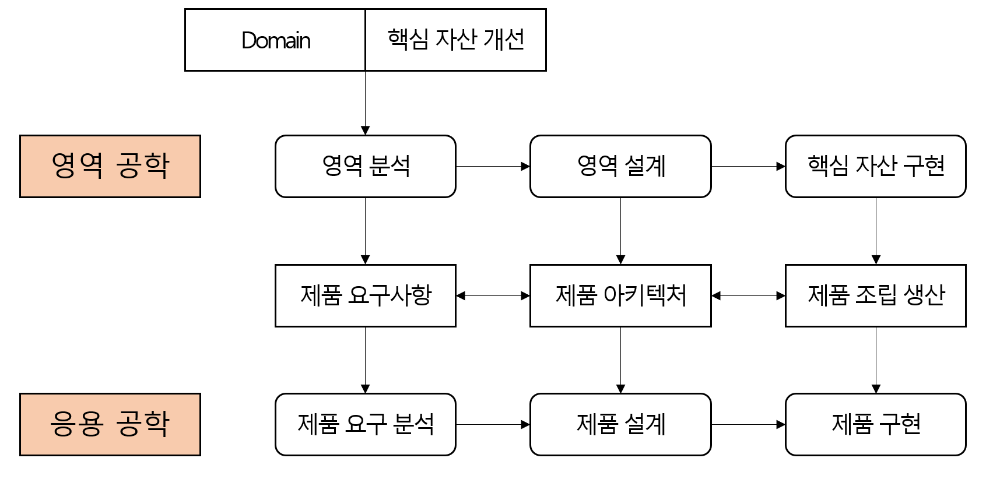

# [정보처리기사 157] - 소프트웨어 개발 방법론 ★

**# 개요**

· SW 개발, 유지보수 등에 필요한 여러 일들의 수행 방법과 이 일들을 효율적으로 수행하기 위한 과정에 필요한 각종 기법 및 도구를 체계적으로 정리 & 표준화 한 것

· 목적 : SW 생산성과 품질 향상

**# 방법론**

**※ 구조적 방법론**

· 정형화된 분석 절차에 따라 사용자 요구사항을 파악하여 문서화

· Process 중심 방법론

· 복잡한 문제를 다루기 위해 분할 정복(Divided and Conquer) 원리 적용

· 목적 : 쉬운 이해 및 검증이 가능한 프로그램 코드 생성

· 절차 : 타당성 검토 > 계획 > 요구사항 > 설계 > 구현 > 시험 > 운영 및 유지보수

**※ 정보공학 방법론**

· 정보 시스템 개발을 위해 계획, 분석, 설계, 구축에 정형화된 기법들을 상호 연관성 있게 통합 및 적용

· Data 중심 방법론

· 정보 시스템 개발 주기를 이용하여 대규모 정보 시스템 구축하는 것에 적합

· 절차 : 정보 전략 계획 수립 > 업무 영역 분석 > 업무 시스템 설계 > 업무 시스템 구축

**※ 객체지향 방법론**

· 현실 세계의 개체를 기계의 부품처럼, 하나의 객체(Entity)로 만들어  부품 조립처럼 객체(Object)들을 모아 SW를 개발하는 방법론

· 구조적 기법의 문제점으로 인한 SW 위기의 해결책으로 채택됨

· 구성 요소 : 객체(Object), 클래스(Class), 메시지(Message) 등

· 기본 원칙 : 캡슐화(Encapsulation), 정보 은닉(Information Hiding), 추상화(Abstraction), 상속성(Inheritance), 다형성(Polymorphism) 등

· 절차 : 요구 분석 > 설계 > 구현 > 테스트 및 검증 > 인도

**※ 컴포넌트 기반 방법론**

· CBD ; Component Based Design

· Component : 문서, 소스코드, 파일, 라이브러리 등과 같이 모듈화 된 자원, 재사용 가능

· 기존 시스템이나 SW를 구성하는 컴포넌트를 조합하여 하나의 새로운 APP을 만드는 것

· 컴포넌트 재사용으로 인해 시간과 노력 절감, 유지 보수 비용 최소화, 생산성 및 품질 향상

· 절차 : 개발 준비 > 분석 > 설계 > 구현 > 테스트 > 전개 > 인도

**※ 애자일 방법론**

· 고객의 요구사항 및 변화에 유연한 대응을 위해 일정 주기를 반복하며 개발 과정을 진행

· 소규모 프로젝트, 숙달된 개발자, 급변하는 요구사항에 적합

· 종류 : XP(eXtreme Programming), Scrum, Kanban, Crystal 등

· 절차 : 사용자 스토리(요구사항) > 계획 > 개발 > 승인 테스트 > ('계획'부터 반복)

**※ 제품 계열 방법론**

· 특정 제품에 적용하고 싶은 공통된 기능을 정의하여 개발하는 방법론

· Embedded SW 개발에 적합

· 영역 공학 : 영역 분석, 영역 설계, 핵심 자산을 구현하는 영역

· 응용 공학 : 제품 요구 분석, 제품 설계, 제품을 구현하는 영역

· 절차

