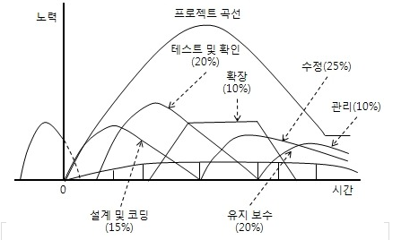

# [정보처리기사 161] - 수학적 산정 기법 ★

# **# 수학적 산정 기법 개요**

· 상향식 비용 산정 기법 중 하나로, 경험적 추정 모형 또는 실험적 추정 모형이라고도 함

· 목표 : 개발 비용 산정의 자동화

· 과거 유사 프로젝트를 기반으로 한 경험적 유도

# **# COCOMO 모형**

**※ 개요**

· COnstructive COst MOdel

· 개발할 SW의 규모(LOC)를 예측한 후, SW 종류에 따라 다르게 책정되는 비용 산정 방정식에 대입하여 최종 비용을 산정

· 비용 견적의 강도 분석 및 비용 견적의 유연성이 높아 SW 개발비 견적에 통용됨

· 같은 규모의 프로그램이어도 그 성격에 따라 비용이 다르게 산정됨

· Man-Month로 비용 산정 결과를 나타냄

**※ COCOMO의 SW 개발 유형**

· 조직형, Organic Mode

​    \- 내부에서 개발된 중/소 규모의 SW로 5만 라인 이하의 SW를 개발하는 유형

​    \- 사무 처리용, 업무용, 과학용 응용 SW 개발에 적합

· 내장형, Embedded Mode

​    \- 최대형 규모의 트랜잭션 처리 시스템, OS 등의 30만 라인 이상의 SW를 개발하는 유형

​    \- 신호기 제어, 미사일 유도, 실시간 처리 등의 시스템 프로그램 개발에 적합

· 반 분리형, Semi-Detached Mode

​    \- 조직형과 내장형의 중간형으로, 트랜잭션 처리 시스팀, OS, DBMS 등의 30만 라인 이하의 SW를 개발하는 유형

​    \- 컴파일러, 인터프리터와 같은 유틸리티 개발에 적합

**※ 모형 종류**

· Basic COCOMO

​    \- SW의 크기(생산 코드 라인 수)와 개발 유형만을 이용하여 비용 산정

· Intermediate COCOMO

​    \- 기본형 모형 공식을 기반으로 사용하지만, 아래 4가지 특성 & 15가지 요인에 의해 비용 산정

​    \- 제품 특성 : 요구되는 신뢰도, DB 크기, 제품 복잡도

​    \- 컴퓨터 특성 : 수행 시간 제한, 기억장소 제한, 가상 기계 안정성, Turn Around Time

​    \- 개발 요원 특성 : 분석가 능력, 개발 분야 경험, 가상 기계 경험, 프로그래머 능력, 프로그래밍 언어 경험

​    \- 프로젝트 특성 : SW 도구 이용, 프로젝트 개발 일정, 최신 프로그래밍 기법의 이용

· Detailed COCOMO

​    \- 중간형 모형을 보완하여 만들어진 발전형 모형

​    \- 개발 공정별로 보다 자세하고 정확하게 노력을 산출하여 비용을 산정하는 모형

​    \- SW 환경과 구성요소가 사전에 정의되어야 하며, 개발 과정의 후반부에 주로 적용함

# **# Putnam 모형**

· SW 생명 주기의 전 과정 동안 사용될 노력의 분포를 가정하는 모형

· 생명 주기 예측 모형이라고도 함

· 시간에 따른 함수로 표현되는 Raleigh-Norden 곡선의 노력 분포도를 기초로 함

<출처 : https://yimma.tistory.com/104>

· 대형 프로젝트의 노력 분포 산정에 이용되는 기법

· 개발 기간이 늘어날 수록 프로젝트 적용 인원의 노력이 감소됨

# **# FP 모형**

· Function Point(기능 점수) 모형

· SW의 기능을 증대시키는 요인별로 가중치를 부여하고, 그 가중치를 합산하여 총 기능 점수 산출

· 총 기능 점수와 영향도를 이용하여 FP를 구한 후 이를 이용해 비용 산정하는 기법

· FP = (총 기능 점수) x [0.65 + (0.1 x 총 영향도)]