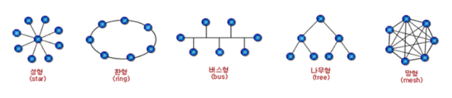

# [정보처리기사 167] - 네트워크 구축 ★

# **# 네트워크 설치 구조**

· 통신망 : Communiation Network, 정보 전달을 위해 연결한 통신 설비의 집합

· 네트워크 설치 구조 : 통신망을 구성하는 요소들을 공간적으로 배치하는 방법

# **# 설치 방식 구분**

  출처 : https://m.blog.naver.com/dltnals1401/100153294777

**※ Star**

· 성형, 중앙 집중형

· 중앙에 중앙 컴퓨터가 있고, 이를 중심으로 단말 장치들이 연결되는 중앙 집중식 형태

· Point to Point 방식으로 회선 연결

· 각 단말 장치는 중앙 컴퓨터를 통하여 데이터 교환

· 단말 장치의 교환이 쉽고, 고장이 나더라도 다른 장치에 영향은 없지만, 중앙 컴퓨터가 고장나면 전체 통신 기능이 정지됨

· 중앙 집중식이므로 교환 노드의 수가 적음

**※ Ring**

· 링형, 환형, 루프형

· 컴퓨터와 단말 장치들을 서로 이웃하는 것끼리 Point-to-Point로 연결시킨 형태

· 분산 및 집중 제어 모두 가능

· 데이터는 단방향과 양방향 전송 모두 가능

· 단말 장치의 추가/제거 및 기밀 보호가 어려움

· 각 단말 장치에서 전송 지연이 발생할 수 있음

· 중계기 수가 많음

**※ Bus**

· 버스형

· 한 개의 통신 회선에 여러 단말 장치가 연결되어 있는 형태

· 물리적 구조가 간단하고, 단말 장치의 추가와 제거가 용이함

· 단말 장치가 고장나도 통신망 전체에 영향을 주지 않기 때문에 신뢰성 높음

· 기밀 보장이 어렵고, 통신 회선의 길이 제한이 있음

**※ Tree**

· 계층형, 분산형

· 중앙 컴퓨터와 일정 지역의 단말 장치까지는 하나의 통신 회선으로 연결시키고, 이웃하는 단말 장치는 일정 지역 내 설치된 중간 단말 장치로부터 다시 연결하는 형태

· 분산 처리 시스템을 구성하는 방식

**※ Mesh**

· 망형

· 모든 지점의 컴퓨터와 단말 장치를 서로 연결한 형태

· 노드의 연결성이 높음

· 많은 단말 장치로부터 많은 양의 통신이 필요한 경우에 유리

· 통신 회선의 총 경로가 가장 김

· 통신 회선 장애 시 다른 경로를 통해 데이터 전송 가능

· 노드가 n개일 때, 모든 노드를 망형으로 연결하기 위해 n(n-1)/2개의 회선이 필요하고, 노드당 n-1개의 포트가 필요

# **# 네트워크 분류**

**※ LAN**

· 근거리 통신망, Local Area Network

· 비교적 가까운 거리에 있는 컴퓨터, 프린터 등과 같은 자원을 연결하여 구성

· 주로 자원 공유를 목적으로 사용

· 사이트 간 거리가 짧아 데이터 전송 속도가 빠르고, 에러 발생율이 낮음

· 근거리 통신망에서는 주로 버스형이나 링형 구조를 사용

**※ WAN**

· 광대역 통신망, Wide Area Network

· 멀리 떨어진 사이트들을 연결하여 구성

· 사이트 간 거리가 멀기 때문에 통신 속도가 느리고, 에러 발생률이 높음

· 일정 지역의 사이트들을 근거리 통신망으로 연결 후 각 근거리 통신망을 연결하는 방식