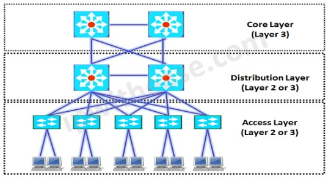

# [정보처리기사 168] - 스위치 ☆

# **# Switch**

**※ 분류**

· 스위치 : 브리지와 같이 LAN과 LAN을 연결하여 더 큰 LAN을 만드는 장치

· L2 스위치

​    \- OSI 2계층에 속하는 장비

​    \- 일반적으로 '스위치'라고 하면 L2 스위치임

​    \- MAC 주소를 기반으로 프레임 전송

​    \- 동일 네트워크 간의 연결만 가능

· L3 스위치

​    \- OSI 3계층에 속하는 장비

​    \- L2 스위치에 라우터 기능 추가

​    \- IP 주소를 기반으로 패킷 전송

​    \- 서로 다른 네트워크 간 연결 가능

· L4 스위치

​    \- OSI 4계층에 속하는 장비

​    \- L3 스위치에 로드밸런서(특정 서버에만 부하가 발생하지 않도록 트래픽을 분산시키는 장비) 추가

​    \- IP 주소 및 TCP/UDP를 기반으로 사용자들의 요구를 서버 중 부하가 적은 곳으로 배분

· L7 스위치

​    \- OSI 7계층에 속하는 장비

​    \- IP 주소, TCP/UDP 포트 정보에 패킷 내용까지 참조하여 세밀하게 로드밸런싱

**※ 방식**

· Store and Forwarding : 데이터를 모두 받은 후 스위칭

· Cut-through : 데이터의 목적지 주소만 확인 후 바로 스위칭

· Fragment Free : 위 두 방식의 장점을 결합한 방식

**※ 백본 스위치**

· Backbone : 여러 네트워크를 연결할 때 중추적 역할을 하는 네트워크

· Backbone Switch : 백본에서 스위칭 역할을 하는 장비

· 모든 패킷이 지나가는 네트워크의 중심에 배치

· 대규모 트래픽을 처리하려면 고성능 백본 스위치를 사용해야 함

· 주로 L3 스위치가 백본 스위치 역할을 함

# **# Hierarchical 3 Layer 모델**

  출처 : https://ipwithease.com/3-layer-cisco-hierarchical-model/

· 네트워크 구성 시 사용되는 모델 중 하나

· Access Layer

​    \- 사용자가 네트워크에 접속할 때 최초로 연결되는 지점

​    \- 사용자로부터 오는 통신을 집약해서 디스트리뷰션 계층으로 전송

​    \- 액세스 계층에 배치되는 장비는 성능은 낮아도 되지만 포트는 사용자 수 만큼 있어야 함

· Distribution Layer

​    \- 액세스 계층의 장치들이 연결되는 지점

​    \- 액세스 계층에서 오는 통신을 집약해서 코어 계층으로 전송

​    \- 라우터, L3 스위치를 사용하여 LAN 간 라우팅 기능 수행

· Core Layer

​    \- 디스트리뷰션 계층에서 오는 통신을 집약해 인터넷에 연결하는 계층

​    \- 백본 스위치를 사용하기 때문에 백본 계층이라고도 함