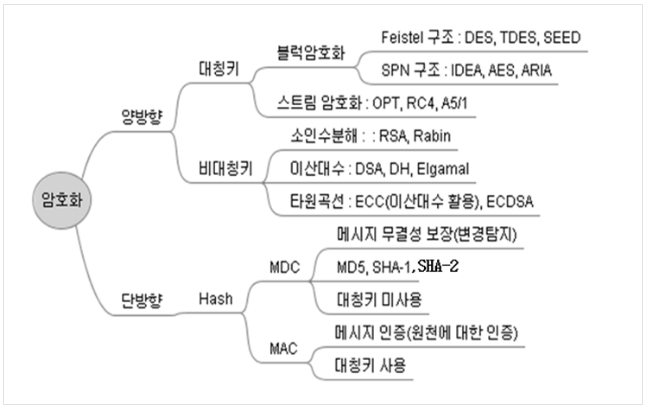
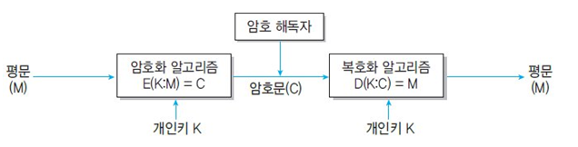
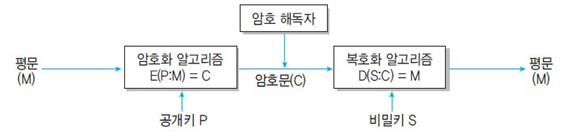

# [정보처리기사 188] - 암호 알고리즘 ★

**# 암호 알고리즘 개요**

· 패스워드, 주민번호, 은행 계좌 등 중요 정보를 보호하기 위해 평문을 암호문으로 변환하는 절차 또는 방법

# **# 암호 방식**

출처 : [http://blog.skby.net/%EC%95%94%ED%98%B8%ED%99%94-encryption/](http://blog.skby.net/암호화-encryption/)

**※ 개인키 암호화 기법, Private Key Encryption**

출처 : https://m.blog.naver.com/ehtm/221937255350

· 동일한 키(대칭키)로 데이터를 암호화 및 복호화

· 대칭 암호 기법 또는 단일 키 암호화 기법이라고도 함

· DB 사용자는 평문의 정보(E)를 암호화 알고리즘(M)과 개인키(K)를 이용하여 암호문(C)으로 변환 후 저장

· 사용자는 그 DB에 접근하기 위해 복호화 알고리즘(D)과 개인키(K)를 이용하여 다시 평문의 정보(M)로 변환하여 이용

· 종류

​    \- 블록 암호화 방식 : 한 번에 하나의 데이터 블록을 암호화 / DES, SEED, AES, ARIA

​    \- 스트림 암호화 방식 : 평문과 동일한 길이의 스트림을 생성하여 비트 단위로 암호화 / LFSR, RC4

· 장단점

​    \- 장점 : 빠른 암호화/복호화 속도, 알고리즘 단순, 공개키 암호에 비해 작은 파일 크기

​    \- 단점 : 사용자 수 증가에 따라 관리해야 할 키의 수가 상대적으로 많아짐

**※ 공개키 암호화 기법, Public Key Encryption**

출처 : https://m.blog.naver.com/ehtm/221937255350

· 데이터를 암호화 할 때 사용하는 공개키는 DB 사용자에게 공개, 복호화할 때 사용하는 비밀키는 관리자가 관리하는 방식

· 비대칭 암호 기법이라고도 함

· DB 사용자는 평문 정보(M)를 암호화 알고리즘(E)과 공개 키(P)를 이용하여 암호문(C)으로 변환하여 저장

· 이를 복호화하기 위해서는 비밀키와 복호화 알고리즘에 권한이 있는 사용자만 복호화 알고리즘(D)과 비밀 키(S)를 이용하여 다시 평문 정보(M)로 변환 가능

· 종류 : RSA(Rivest Shamir Adleman) 기법

· 장/단점

​    \- 장점 : 키의 분배가 용이하고, 관리해야 할 키의 개수가 적음

​    \- 단점 : 느린 암호화/복호화, 알고리즘 복잡, 개인키 암호화 기법보다 파일 크기가 큼

**※ Hash**

· 임의의 길이를 갖는 입력 데이터나 메시지를 고정도니 길이 값이나 키로 변환하는 것

· 해시 함수라고도 부르며, 해시를 통해 변환된 값이나 키를 해시 값 또는 해시 키라고 함

· 데이터 암호화, 무결성 검증을 위해 사용되기도 하고, 정보보호의 다양한 분야에서 활용됨

· 종류 : SHA 시리즈, MD5, N-NASH, SNEFRU 등